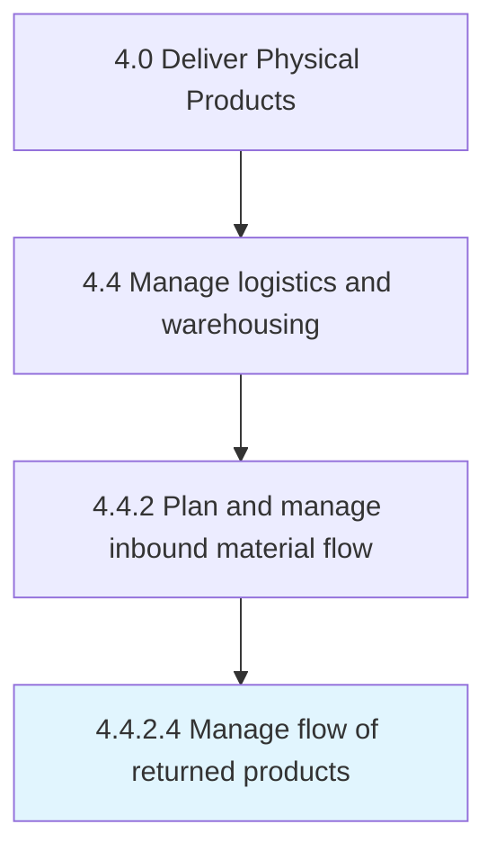

# Manage flow of returned products

> Tracking and taking care of the products that have been internally returned either because of their deficiency or in cases of incorrect delivery.

## Overview

Activity 4.4.2.4 is an activity within the Deliver Physical Products framework. 

Tracking and taking care of the products that have been internally returned either because of their deficiency or in cases of incorrect delivery.

## Process Hierarchy



## Key Statistics

| Metric | Value |
|--------|-------|
| APQC Code | 10352 |
| Hierarchy ID | 4.4.2.4 |
| Level | Activity |
| Parent | [4.4.2](../) |
| Sub-Processes | 0 |


## GraphDL Semantic Structure

```
manage.Flow.of.ReturnedProducts
```

| Component | Value | Description |
|-----------|-------|-------------|
| Verb | `manage` | Primary action |
| Object | `flow` | Direct object |
| Preposition | `of` | Relationship |
| PrepObject | `returned products` | Indirect object |


## Related Concepts

- Flow
- ReturnedProducts


---

*Source: APQC PCF 10352 (4.4.2.4) - APQC*
