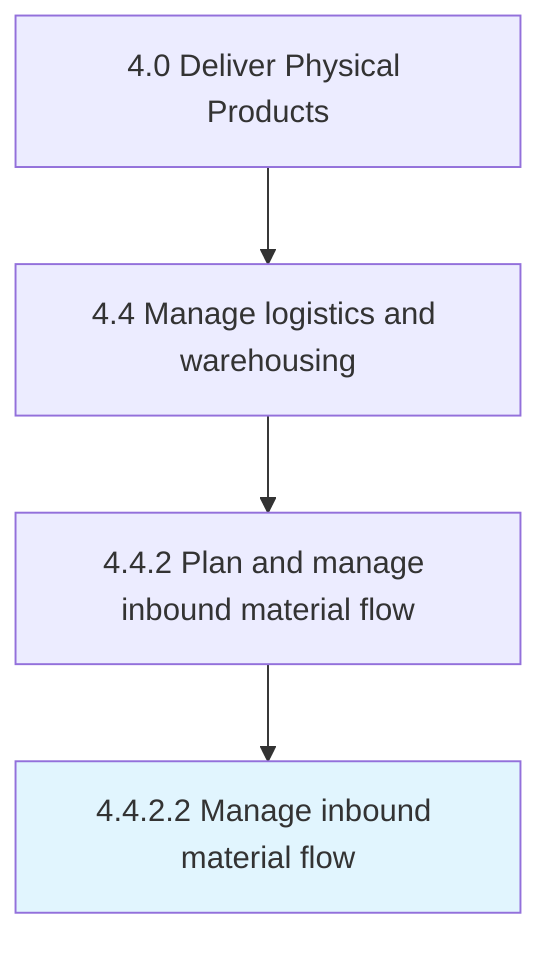

# Manage inbound material flow

> Managing all the internal activities related to the flow/transfer of materials.

## Overview

Activity 4.4.2.2 is an activity within the Deliver Physical Products framework. 

Managing all the internal activities related to the flow/transfer of materials. Manage materials being delivered to distribution center or warehouse. Gauge the time taken for delivery and if the delivery process is on time.

## Process Hierarchy



## Key Statistics

| Metric | Value |
|--------|-------|
| APQC Code | 10350 |
| Hierarchy ID | 4.4.2.2 |
| Level | Activity |
| Parent | [4.4.2](../) |
| Sub-Processes | 0 |


## GraphDL Semantic Structure

```
manage.InboundMaterialFlow
```

| Component | Value | Description |
|-----------|-------|-------------|
| Verb | `manage` | Primary action |
| Object | `inbound material flow` | Direct object |


## Related Concepts

- [InboundMaterialFlow](/concepts/InboundMaterialFlow)


---

*Source: APQC PCF 10350 (4.4.2.2) - APQC*
