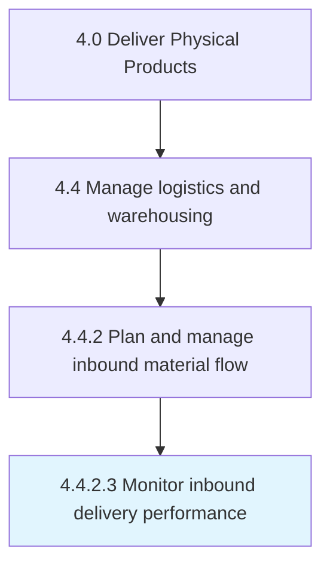

# Monitor inbound delivery performance

> Overseeing the performance of an inbound delivery system.

## Overview

Activity 4.4.2.3 is an activity within the Deliver Physical Products framework. 

Overseeing the performance of an inbound delivery system. Check the present delivery system's efficiency, cost effectiveness, and adherence to a delivery schedule.

## Process Hierarchy



## Key Statistics

| Metric | Value |
|--------|-------|
| APQC Code | 10351 |
| Hierarchy ID | 4.4.2.3 |
| Level | Activity |
| Parent | [4.4.2](../) |
| Sub-Processes | 0 |


## GraphDL Semantic Structure

```
monitor.InboundDeliveryPerformance
```

| Component | Value | Description |
|-----------|-------|-------------|
| Verb | `monitor` | Primary action |
| Object | `inbound delivery performance` | Direct object |


## Related Concepts

- InboundDeliveryPerformance


---

*Source: APQC PCF 10351 (4.4.2.3) - APQC*
