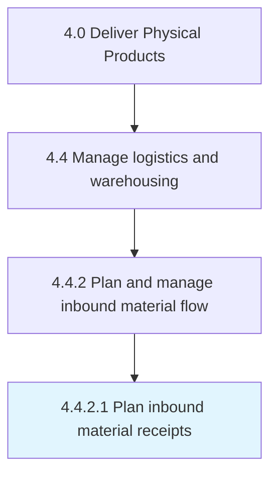

# Plan inbound material receipts

> Managing the receipts of inbound materials.

## Overview

Activity 4.4.2.1 is an activity within the Deliver Physical Products framework. 

Managing the receipts of inbound materials. Create a plan accounting for the materials procured from the source of supply and the materials delivered to the distribution center or the warehouse.

## Process Hierarchy



## Key Statistics

| Metric | Value |
|--------|-------|
| APQC Code | 10349 |
| Hierarchy ID | 4.4.2.1 |
| Level | Activity |
| Parent | [4.4.2](../) |
| Sub-Processes | 0 |


## GraphDL Semantic Structure

```
plan.InboundMaterialReceipts
```

| Component | Value | Description |
|-----------|-------|-------------|
| Verb | `plan` | Primary action |
| Object | `inbound material receipts` | Direct object |


## Related Concepts

- InboundMaterialReceipts


---

*Source: APQC PCF 10349 (4.4.2.1) - APQC*
