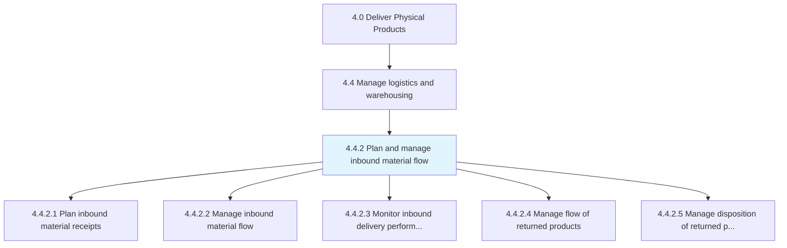
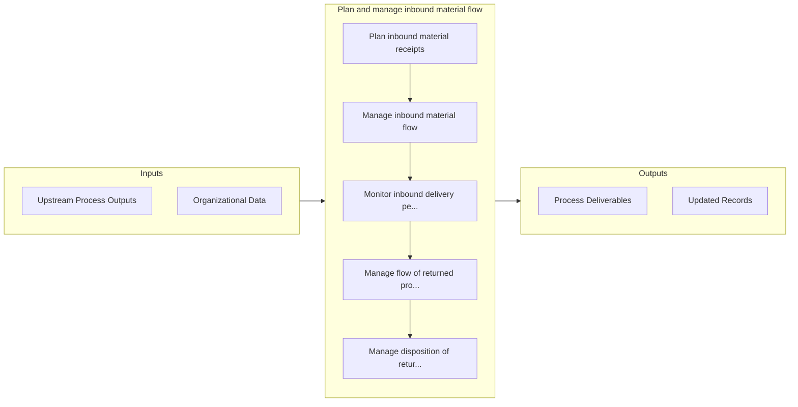

# Plan and manage inbound material flow

> Creating and executing a strategy for all the internal activities related to the flow/transfer of inbound materials.

## Overview

Process 4.4.2 is a core process that defines the specific procedures for plan and manage inbound material flow. 

Creating and executing a strategy for all the internal activities related to the flow/transfer of inbound materials. This process includes planning inbound material receipts, managing inbound material flow, monitoring inbound delivery performance, managing the flow of returned products, controlling the quality of returned parts, and salvaging or repairing returned products.

## Process Hierarchy



## Key Statistics

| Metric | Value |
|--------|-------|
| APQC Code | 20936 |
| Hierarchy ID | 4.4.2 |
| Level | Process |
| Parent | [4.4](../) |
| Sub-Processes | 5 |


## GraphDL Semantic Structure

```
plan.AndManageInboundMaterialFlow
```

| Component | Value | Description |
|-----------|-------|-------------|
| Verb | `plan` | Primary action |
| Object | `and manage inbound material flow` | Direct object |


## Process Flow



## Sub-Processes

| Process | Hierarchy ID | Description |
|---------|-------------|-------------|
| [Plan inbound material receipts](./PlanInboundMaterialReceipts) | 4.4.2.1 | Managing the receipts of inbound materials |
| [Manage inbound material flow](./ManageInboundMaterialFlow) | 4.4.2.2 | Managing all the internal activities related to the flow/transfer of materials |
| [Monitor inbound delivery performance](./MonitorInboundDeliveryPerformance) | 4.4.2.3 | Overseeing the performance of an inbound delivery system |
| [Manage flow of returned products](./ManageFlowOfReturnedProducts) | 4.4.2.4 | Tracking and taking care of the products that have been internally returned either because of their  |
| [Manage disposition of returned products](./4.4.2.5-ManageDispositionReturnedProducts/) | 4.4.2.5 | Determining if a returned product can be salvaged or repaired |


## Related Concepts

- InboundMaterialFlow
- InboundMaterialFlow


---

*Source: APQC PCF 20936 (4.4.2) - APQC*
