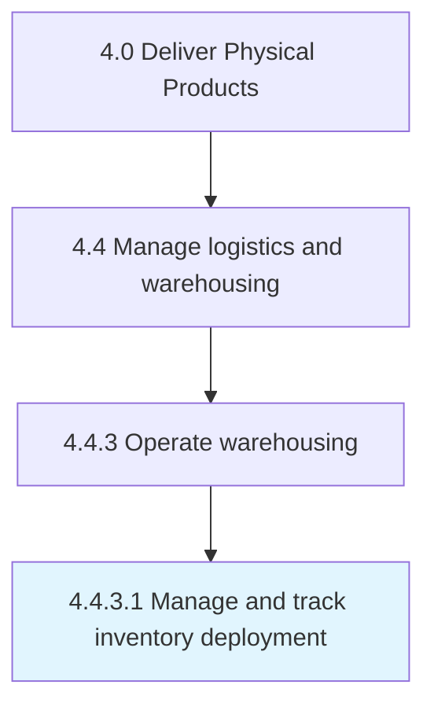

# Manage and track inventory deployment

> Tracking the logistical act of delivering or releasing an inventory item or entity to targeted end users.

## Overview

Activity 4.4.3.1 is an activity within the Deliver Physical Products framework. 

Tracking the logistical act of delivering or releasing an inventory item or entity to targeted end users. Track how much inventory has been deployed at all the distribution centers, individually.

## Process Hierarchy



## Key Statistics

| Metric | Value |
|--------|-------|
| APQC Code | 10353 |
| Hierarchy ID | 4.4.3.1 |
| Level | Activity |
| Parent | [4.4.3](../) |
| Sub-Processes | 0 |


## GraphDL Semantic Structure

```
manage.AndTrackInventoryDeployment
```

| Component | Value | Description |
|-----------|-------|-------------|
| Verb | `manage` | Primary action |
| Object | `and track inventory deployment` | Direct object |


## Related Concepts

- [InventoryDeployment](/concepts/InventoryDeployment)
- [InventoryDeployment](/concepts/InventoryDeployment)


---

*Source: APQC PCF 10353 (4.4.3.1) - APQC*
