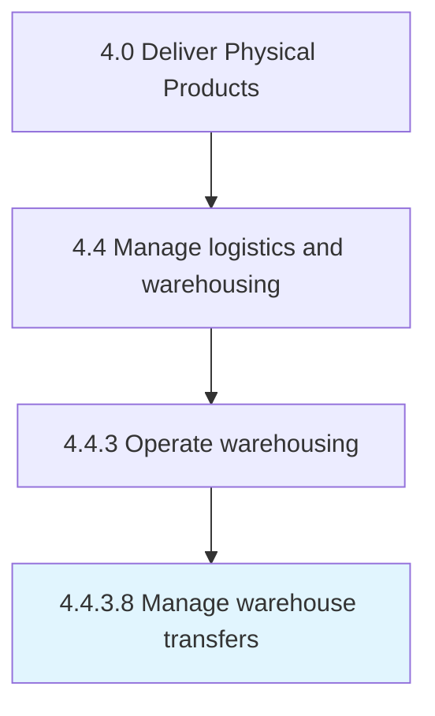

# Manage warehouse transfers

> Shipping items from one warehouse to another in a multi-warehouse environment.

## Overview

Activity 4.4.3.8 is an activity within the Deliver Physical Products framework. 

Shipping items from one warehouse to another in a multi-warehouse environment. A warehouse transfer is typically handled electronically in a system designed to replicate the physical processes involved with transferring items from one warehouse to another.

## Process Hierarchy



## Key Statistics

| Metric | Value |
|--------|-------|
| APQC Code | 20957 |
| Hierarchy ID | 4.4.3.8 |
| Level | Activity |
| Parent | [4.4.3](../) |
| Sub-Processes | 0 |


## GraphDL Semantic Structure

```
manage.WarehouseTransfers
```

| Component | Value | Description |
|-----------|-------|-------------|
| Verb | `manage` | Primary action |
| Object | `warehouse transfers` | Direct object |


## Related Concepts

- WarehouseTransfers


---

*Source: APQC PCF 20957 (4.4.3.8) - APQC*
