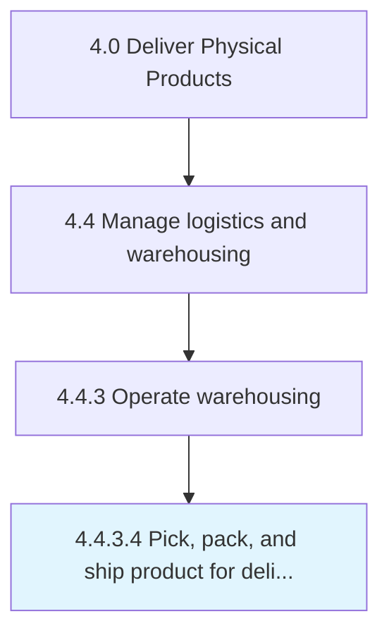

# Pick, pack, and ship product for delivery

> Packing and shipping the product to deliver to the customer.

## Overview

Activity 4.4.3.4 is an activity within the Deliver Physical Products framework. 

Packing and shipping the product to deliver to the customer. Take care of the internal and external packaging of the products in order to ensure safe transportation of the products from the warehouse to delivery locations. Notify the ERP system and/or Accounts Receivable Dept.

## Process Hierarchy



## Key Statistics

| Metric | Value |
|--------|-------|
| APQC Code | 10356 |
| Hierarchy ID | 4.4.3.4 |
| Level | Activity |
| Parent | [4.4.3](../) |
| Sub-Processes | 0 |


## GraphDL Semantic Structure

```
pick,.PackAndShipProduct.for.Delivery
```

| Component | Value | Description |
|-----------|-------|-------------|
| Verb | `pick,` | Primary action |
| Object | `pack, and ship product` | Direct object |
| Preposition | `for` | Relationship |
| PrepObject | `delivery` | Indirect object |


## Related Concepts

- Product
- Delivery
- Product
- Delivery
- Product
- Delivery


---

*Source: APQC PCF 10356 (4.4.3.4) - APQC*
