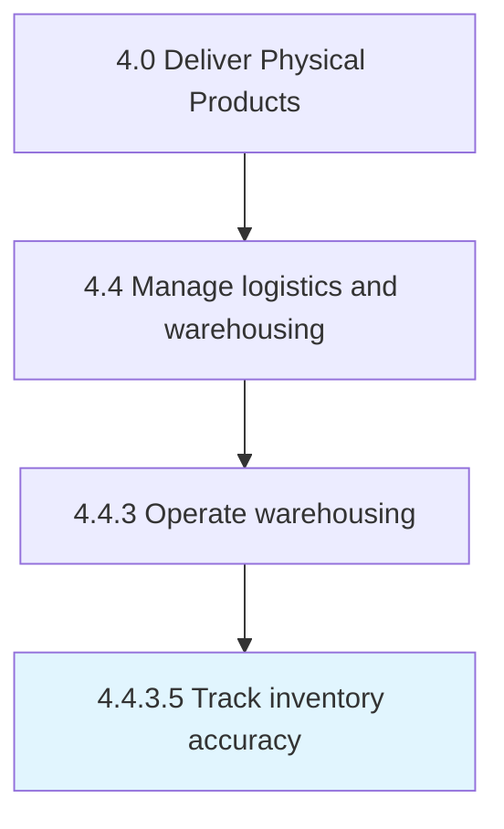

# Track inventory accuracy

> Monitoring any discrepancies between electronic records that represent the inventory and the physical state of the inventory.

## Overview

Activity 4.4.3.5 is an activity within the Deliver Physical Products framework. 

Monitoring any discrepancies between electronic records that represent the inventory and the physical state of the inventory. Look for discrepancies such as phantom inventory, which includes products that an inventory accounting system considers to be available at the storage location but are not actually available.

## Process Hierarchy



## Key Statistics

| Metric | Value |
|--------|-------|
| APQC Code | 10357 |
| Hierarchy ID | 4.4.3.5 |
| Level | Activity |
| Parent | [4.4.3](../) |
| Sub-Processes | 0 |


## GraphDL Semantic Structure

```
track.InventoryAccuracy
```

| Component | Value | Description |
|-----------|-------|-------------|
| Verb | `track` | Primary action |
| Object | `inventory accuracy` | Direct object |


## Related Concepts

- InventoryAccuracy


---

*Source: APQC PCF 10357 (4.4.3.5) - APQC*
