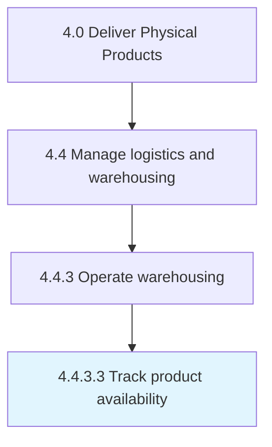

# Track product availability

> Keeping track of the availability of different materials/products at the warehouse and distribution centers.

## Overview

Activity 4.4.3.3 is an activity within the Deliver Physical Products framework. 

Keeping track of the availability of different materials/products at the warehouse and distribution centers.

## Process Hierarchy



## Key Statistics

| Metric | Value |
|--------|-------|
| APQC Code | 10355 |
| Hierarchy ID | 4.4.3.3 |
| Level | Activity |
| Parent | [4.4.3](../) |
| Sub-Processes | 0 |


## GraphDL Semantic Structure

```
track.ProductAvailability
```

| Component | Value | Description |
|-----------|-------|-------------|
| Verb | `track` | Primary action |
| Object | `product availability` | Direct object |


## Related Concepts

- ProductAvailability


---

*Source: APQC PCF 10355 (4.4.3.3) - APQC*
