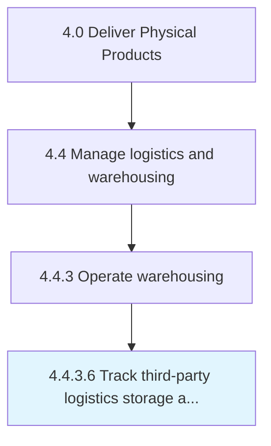
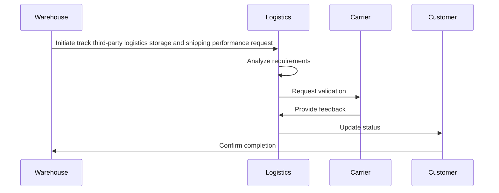

# Track third-party logistics storage and shipping performance

> Keeping a track on the storage and shipping performance of third-party agencies.

## Overview

This activity encompasses the end-to-end process of track third-party logistics storage and shipping performance within the supply chain and physical product delivery domain. It involves coordinating cross-functional teams, applying standardized methodologies, and leveraging organizational data to ensure consistent and effective outcomes. The process is aligned with the broader Deliver Physical Products framework (APQC 4.4.3.6) and supports strategic objectives by translating operational requirements into actionable procedures.

Effective execution of this activity requires clear ownership, well-defined inputs and outputs, and continuous monitoring against established benchmarks. Organizations that excel at this process typically integrate it with upstream planning activities and downstream performance measurement, creating a feedback loop that drives ongoing improvement and adaptation to changing business conditions.


## Process Hierarchy



## Key Statistics

| Metric | Value |
|--------|-------|
| APQC Code | 10358 |
| Hierarchy ID | 4.4.3.6 |
| Level | Activity |
| Parent | [4.4.3](../) |
| Sub-Processes | 0 |


## Process Overview

Delivery processes manage the supply chain, procurement, production, and logistics to deliver physical products. This process focuses on track third-party logistics storage and shipping performance, which is essential for organizational effectiveness and achieving business objectives.

## Key Metrics

| Metric | Description | Target |
|--------|-------------|--------|
| On-time delivery | Measure of on-time delivery | Target varies by organization |
| Inventory turnover | Measure of inventory turnover | Target varies by organization |
| Order accuracy | Measure of order accuracy | Target varies by organization |
| Supply chain cost | Measure of supply chain cost | Target varies by organization |

## Related Departments

- [Operations](/departments/Operations)
- [Supply Chain](/departments/Supply Chain)
- [Logistics](/departments/Logistics)

## Related Occupations

- [Supply Chain Managers](/occupations/Business/Logisticians)
- [Production Managers](/occupations/Management/IndustrialProductionManagers)
- [Logistics Coordinators](/occupations/Business/Logisticians)

## RACI Matrix

| Activity | Responsible | Accountable | Consulted | Informed |
|----------|-------------|-------------|-----------|----------|
| Plan | Process Owner | Manager | Stakeholders | Team |
| Execute | Team | Process Owner | Manager | Stakeholders |
| Monitor | Analyst | Manager | Process Owner | Leadership |
| Improve | Process Owner | Manager | Team | Stakeholders |

## GraphDL Semantic Structure

```graphdl
track.ThirdpartyLogisticsStorageAndShippingPerformance
```

| Component | Value | Description |
|-----------|-------|-------------|
| Verb | `track` | Primary action |
| Object | `third-party logistics storage and shipping performance` | Direct object |


## Process Sequence


---

*Source: APQC PCF 10358 (4.4.3.6) - APQC*
