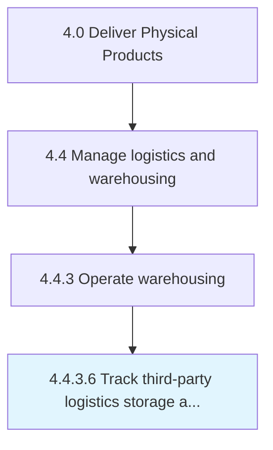

# Track third-party logistics storage and shipping performance

> Keeping a track on the storage and shipping performance of third-party agencies.

## Overview

Activity 4.4.3.6 is an activity within the Deliver Physical Products framework. 

Keeping a track on the storage and shipping performance of third-party agencies. Monitor logistics storage and shipping performance for third-party agencies. Use measures such as a logistics scoreboard, activity-based costing, economic value analysis, and balanced scorecards.

## Process Hierarchy



## Key Statistics

| Metric | Value |
|--------|-------|
| APQC Code | 10358 |
| Hierarchy ID | 4.4.3.6 |
| Level | Activity |
| Parent | [4.4.3](../) |
| Sub-Processes | 0 |


## GraphDL Semantic Structure

```
track.ThirdpartyLogisticsStorageAndShippingPerformance
```

| Component | Value | Description |
|-----------|-------|-------------|
| Verb | `track` | Primary action |
| Object | `third-party logistics storage and shipping performance` | Direct object |


---

*Source: APQC PCF 10358 (4.4.3.6) - APQC*
