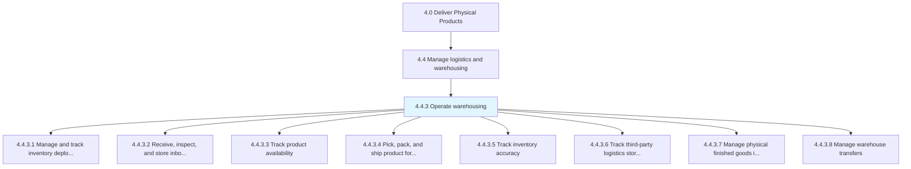
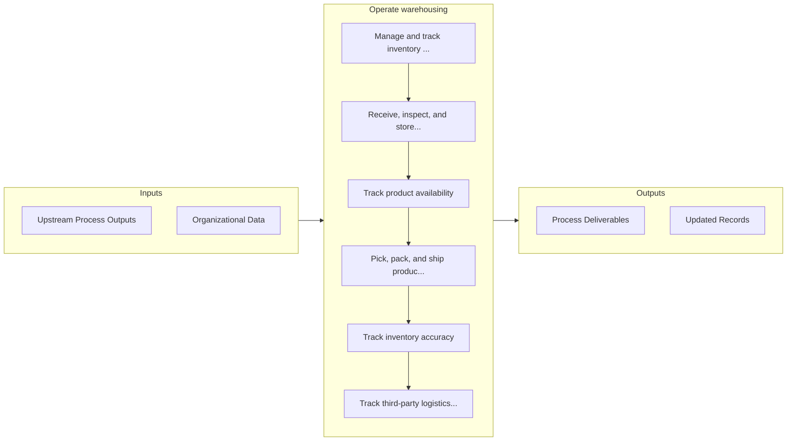

# Operate warehousing

> Tracking the inventory deployment.

## Overview

Process 4.4.3 is a core process that defines the specific procedures for operate warehousing. 

Tracking the inventory deployment. Accept and store products. Ship the products. Measure the accuracy of the inventory. Assess the performance of the outsourced logistics activities.

## Process Hierarchy



## Key Statistics

| Metric | Value |
|--------|-------|
| APQC Code | 10340 |
| Hierarchy ID | 4.4.3 |
| Level | Process |
| Parent | [4.4](../) |
| Sub-Processes | 8 |


## GraphDL Semantic Structure

```
operate.Warehousing
```

| Component | Value | Description |
|-----------|-------|-------------|
| Verb | `operate` | Primary action |
| Object | `warehousing` | Direct object |


## Process Flow



## Sub-Processes

| Process | Hierarchy ID | Description |
|---------|-------------|-------------|
| [Manage and track inventory deployment](./ManageAndTrackInventoryDeployment) | 4.4.3.1 | Tracking the logistical act of delivering or releasing an inventory item or entity to targeted end u |
| [Receive, inspect, and store inbound deliveries](./ReceiveInspectAndStoreInboundDeliveries) | 4.4.3.2 | Coordinating the incoming inbound materials/products |
| [Track product availability](./TrackProductAvailability) | 4.4.3.3 | Keeping track of the availability of different materials/products at the warehouse and distribution  |
| [Pick, pack, and ship product for delivery](./PickPackAndShipProductForDelivery) | 4.4.3.4 | Packing and shipping the product to deliver to the customer |
| [Track inventory accuracy](./TrackInventoryAccuracy) | 4.4.3.5 | Monitoring any discrepancies between electronic records that represent the inventory and the physica |
| [Track third-party logistics storage and shipping performance](./TrackThirdpartyLogisticsStorageAndShippingPerformance) | 4.4.3.6 | Keeping a track on the storage and shipping performance of third-party agencies |
| [Manage physical finished goods inventory](./ManagePhysicalFinishedGoodsInventory) | 4.4.3.7 | Administering the movement of the finished products that are processed by the organization through i |
| [Manage warehouse transfers](./ManageWarehouseTransfers) | 4.4.3.8 | Shipping items from one warehouse to another in a multi-warehouse environment |


## Related Concepts

- [Warehousing](/concepts/Warehousing)


---

*Source: APQC PCF 10340 (4.4.3) - APQC*
