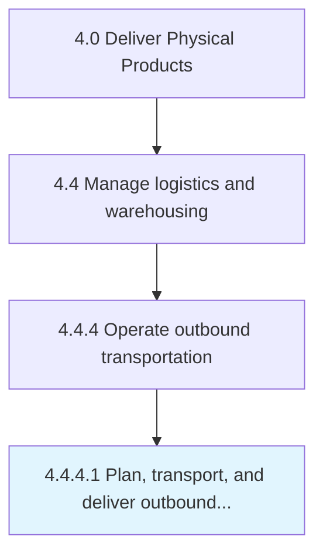

# Plan, transport, and deliver outbound product

> Organizing the transportation and delivery of outbound products.

## Overview

Activity 4.4.4.1 is an activity within the Deliver Physical Products framework. 

Organizing the transportation and delivery of outbound products. Plan and organize the transportation, shipping, and delivery of the end products. Create a plan that specifies dispatch and delivery of the product to its destination, as well the transportation.

## Process Hierarchy



## Key Statistics

| Metric | Value |
|--------|-------|
| APQC Code | 10360 |
| Hierarchy ID | 4.4.4.1 |
| Level | Activity |
| Parent | [4.4.4](../) |
| Sub-Processes | 0 |


## GraphDL Semantic Structure

```
plan,.TransportAndDeliverOutboundProduct
```

| Component | Value | Description |
|-----------|-------|-------------|
| Verb | `plan,` | Primary action |
| Object | `transport, and deliver outbound product` | Direct object |


## Related Concepts

- [OutboundProduct](/concepts/OutboundProduct)
- [OutboundProduct](/concepts/OutboundProduct)
- [OutboundProduct](/concepts/OutboundProduct)


---

*Source: APQC PCF 10360 (4.4.4.1) - APQC*
