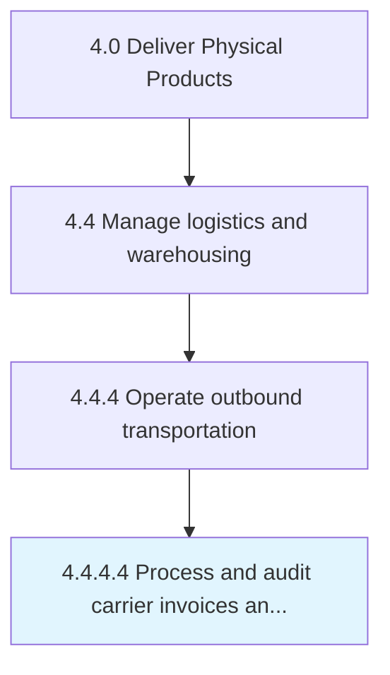

# Process and audit carrier invoices and documents

> Organizing and inspecting all account statements and any other documentation for the carriers used in delivery.

## Overview

Activity 4.4.4.4 is an activity within the Deliver Physical Products framework. 

Organizing and inspecting all account statements and any other documentation for the carriers used in delivery. Create, manage, and inspect all documents related to the financial, regulatory, and administrative accounts of all the carriers/freights. Generate receipts for all freight transactions.

## Process Hierarchy



## Key Statistics

| Metric | Value |
|--------|-------|
| APQC Code | 10363 |
| Hierarchy ID | 4.4.4.4 |
| Level | Activity |
| Parent | [4.4.4](../) |
| Sub-Processes | 0 |


## GraphDL Semantic Structure

```
process.AndAuditCarrierInvoicesAndDocuments
```

| Component | Value | Description |
|-----------|-------|-------------|
| Verb | `process` | Primary action |
| Object | `and audit carrier invoices and documents` | Direct object |


## Related Concepts

- CarrierInvoices
- Documents
- CarrierInvoices
- Documents


---

*Source: APQC PCF 10363 (4.4.4.4) - APQC*
