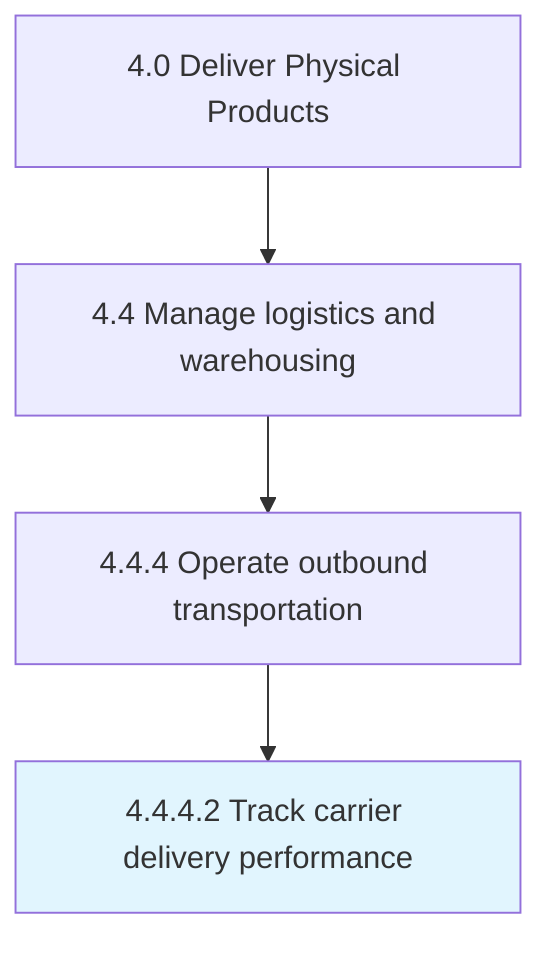

# Track carrier delivery performance

> Monitoring delivery performance when carrying products from the warehouse/distribution centers to the retailers or end consumers.

## Overview

Activity 4.4.4.2 is an activity within the Deliver Physical Products framework. 

Monitoring delivery performance when carrying products from the warehouse/distribution centers to the retailers or end consumers. Create a performance metrics based on the key performance indicators.

## Process Hierarchy



## Key Statistics

| Metric | Value |
|--------|-------|
| APQC Code | 10361 |
| Hierarchy ID | 4.4.4.2 |
| Level | Activity |
| Parent | [4.4.4](../) |
| Sub-Processes | 0 |


## GraphDL Semantic Structure

```
track.CarrierDeliveryPerformance
```

| Component | Value | Description |
|-----------|-------|-------------|
| Verb | `track` | Primary action |
| Object | `carrier delivery performance` | Direct object |


## Related Concepts

- [CarrierDeliveryPerformance](/concepts/CarrierDeliveryPerformance)


---

*Source: APQC PCF 10361 (4.4.4.2) - APQC*
