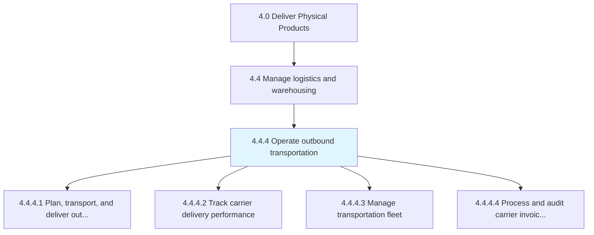
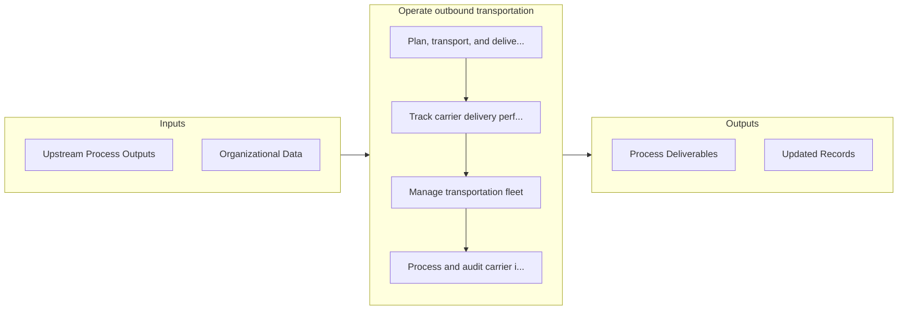

# Operate outbound transportation

> Creating a plan that specifies the schedule and system for transportation and delivery of the outbound products, as well as tracking the performance of the carrier delivery system.

## Overview

Process 4.4.4 is a core process that defines the specific procedures for operate outbound transportation. 

Creating a plan that specifies the schedule and system for transportation and delivery of the outbound products, as well as tracking the performance of the carrier delivery system. Conduct vehicle management and processing of all carrier-related documents.

## Process Hierarchy



## Key Statistics

| Metric | Value |
|--------|-------|
| APQC Code | 10341 |
| Hierarchy ID | 4.4.4 |
| Level | Process |
| Parent | [4.4](../) |
| Sub-Processes | 4 |


## GraphDL Semantic Structure

```
operate.OutboundTransportation
```

| Component | Value | Description |
|-----------|-------|-------------|
| Verb | `operate` | Primary action |
| Object | `outbound transportation` | Direct object |


## Process Flow



## Sub-Processes

| Process | Hierarchy ID | Description |
|---------|-------------|-------------|
| [Plan, transport, and deliver outbound product](./PlanTransportAndDeliverOutboundProduct) | 4.4.4.1 | Organizing the transportation and delivery of outbound products |
| [Track carrier delivery performance](./TrackCarrierDeliveryPerformance) | 4.4.4.2 | Monitoring delivery performance when carrying products from the warehouse/distribution centers to th |
| [Manage transportation fleet](./ManageTransportationFleet) | 4.4.4.3 | Taking care of a range of functions related to the means of transport used for delivering the end pr |
| [Process and audit carrier invoices and documents](./ProcessAndAuditCarrierInvoicesAndDocuments) | 4.4.4.4 | Organizing and inspecting all account statements and any other documentation for the carriers used i |


## Related Concepts

- [OutboundTransportation](/concepts/OutboundTransportation)


---

*Source: APQC PCF 10341 (4.4.4) - APQC*
