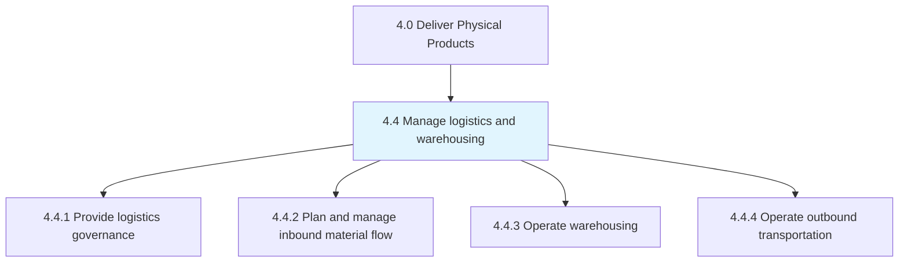
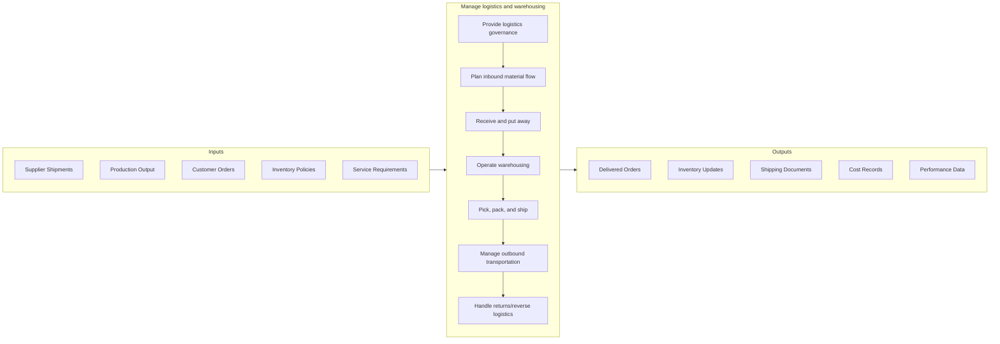

# Manage logistics and warehousing

> Administering and overseeing all activities related to logistics and warehousing.

## Overview

Group 4.4 is a process group within [Deliver Physical Products](../) that encompasses the movement and storage of materials and products throughout the supply chain. This process group ensures products flow efficiently from suppliers through manufacturing to customers while maintaining inventory accuracy and service levels.

Logistics and warehousing operations are critical enablers of supply chain performance. Effective management requires balancing service level commitments with cost efficiency across inbound logistics, warehousing operations, and outbound transportation. Modern logistics leverages technology including WMS (Warehouse Management Systems), TMS (Transportation Management Systems), and automation to optimize operations and provide visibility throughout the supply chain.

## Process Hierarchy



## Key Statistics

| Metric | Value |
|--------|-------|
| APQC Code | 10219 |
| Hierarchy ID | 4.4 |
| Level | Group |
| Parent | [4](../) |
| Sub-Processes | 4 |

## GraphDL Semantic Structure

```graphdl
manage.Logistics.for.Distribution
```

| Component | Value | Description |
|-----------|-------|-------------|
| Verb | `manage` | Primary action of overseeing |
| Object | `Logistics` | Movement and storage activities |
| Preposition | `for` | Purpose relationship |
| PrepObject | `Distribution` | Product delivery to customers |

## Process Flow



## Child Processes

| Process | Hierarchy ID | Description |
|---------|-------------|-------------|
| [Provide logistics governance](./4.4.1-ProvideLogisticsGovernance/) | 4.4.1 | Establishing logistics strategy, policies, and performance management |
| [Plan and manage inbound material flow](./4.4.2-PlanManageInboundMaterial/) | 4.4.2 | Coordinating receipt of materials from suppliers and production |
| [Operate warehousing](./4.4.3-OperateWarehousing/) | 4.4.3 | Managing storage, inventory control, and order fulfillment operations |
| [Operate outbound transportation](./4.4.4-OperateOutboundTransportation/) | 4.4.4 | Planning and executing shipments to customers |

## RACI Matrix

| Activity | Responsible | Accountable | Consulted | Informed |
|----------|-------------|-------------|-----------|----------|
| Develop logistics strategy | Logistics Planning | VP Supply Chain | Operations, Finance | Leadership |
| Manage inbound logistics | Inbound Logistics | Logistics Manager | Procurement, Production | Planning |
| Operate warehousing | Warehouse Operations | DC Manager | IT, Quality | Sales |
| Manage outbound transportation | Transportation | Logistics Manager | Sales, Carriers | Customers |
| Control inventory | Inventory Control | DC Manager | Planning, Finance | Operations |
| Manage carrier relationships | Transportation | VP Supply Chain | Procurement | Finance |

## Key Stakeholders

- **Logistics Leadership**: Sets strategy and manages performance
- **Warehouse Operations**: Executes storage and fulfillment
- **Transportation**: Manages carrier relationships and shipments
- **Inventory Control**: Maintains inventory accuracy
- **Carriers/3PLs**: Provide transportation and warehouse services
- **Customers**: Receive products and service commitments
- **Sales**: Communicates customer requirements

## Metrics and KPIs

| Metric | Description | Target |
|--------|-------------|--------|
| On-Time Delivery | Shipments delivered when promised | >98% |
| Order Accuracy | Orders shipped correctly | >99.5% |
| Inventory Accuracy | Cycle count accuracy | >99% |
| Warehouse Productivity | Units processed per labor hour | Benchmark |
| Transportation Cost | Cost per unit shipped | Continuous improvement |
| Dock-to-Stock Time | Hours from receipt to available | <24 hours |
| Order Cycle Time | Hours from order to shipment | Per SLA |
| Damage Rate | Percentage of shipments damaged | <0.1% |

## Related Departments

- [Logistics](/departments/SupplyChain/Logistics) - Operations oversight
- [Distribution](/departments/SupplyChain/Distribution) - DC operations
- [Transportation](/departments/SupplyChain/Transportation) - Carrier management
- [Operations](/departments/Operations) - Inventory and fulfillment

## Related Occupations

- [Logisticians](/occupations/Business/Logisticians) - Logistics coordination
- [Transportation Managers](/occupations/TransportationManagers) - Transport oversight
- [Storage and Distribution Managers](/occupations/Management/StorageDistributionManagers) - Warehouse management
- [Shipping Clerks](/occupations/OfficeAdmin/ShippingClerks) - Shipping operations

## Industry Variations

### Retail
Omnichannel fulfillment, high-volume DC operations, last-mile delivery optimization, and seasonal peak management.

### E-Commerce
Rapid fulfillment requirements, small parcel shipping optimization, and customer-facing delivery tracking.

### Manufacturing
JIT inbound logistics, production staging, and coordinated shipping with production schedules.

### Food and Beverage
Temperature-controlled logistics, FIFO inventory management, and food safety requirements in handling.

### Pharmaceutical
Cold chain management, lot tracking, regulatory compliance, and controlled substance handling.

## Related Concepts

- WarehouseManagement
- TransportationManagement
- InventoryControl
- FulfillmentOperations
- ReverseLogistics
- SupplyChainVisibility
- LastMileDelivery

---

*Source: APQC PCF 10219 (4.4) - APQC*
