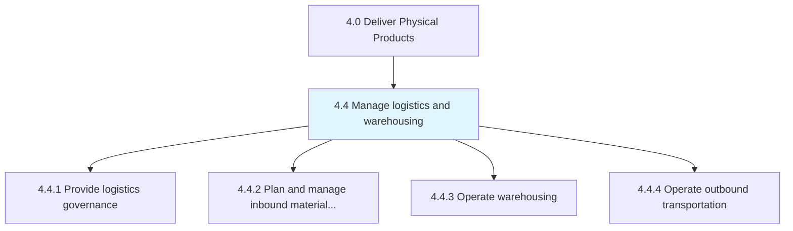
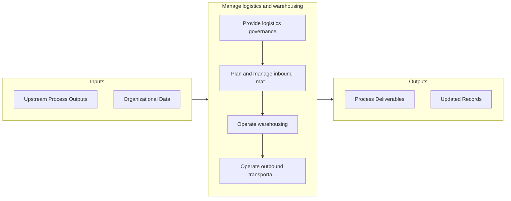

# Manage logistics and warehousing

> Administering and overseeing all activities related to logistics and warehousing.

## Overview

Group 4.4 is a process group within APQC Category 4.0 (Deliver Physical Products). 

Administering and overseeing all activities related to logistics and warehousing. Outline and establish a strategy for the logistics function. Plan and administer the flow of inbound materials. Administer the operational activities of warehousing and outbound transportation. Manage reverse logistics including returns and exchanges.

## Process Hierarchy



## Key Statistics

| Metric | Value |
|--------|-------|
| APQC Code | 10219 |
| Hierarchy ID | 4.4 |
| Level | Group |
| Parent | [4](../) |
| Sub-Processes | 4 |


## GraphDL Semantic Structure

```
manage.LogisticsAndWarehousing
```

| Component | Value | Description |
|-----------|-------|-------------|
| Verb | `manage` | Primary action |
| Object | `logistics and warehousing` | Direct object |


## Process Flow



## Sub-Processes

| Process | Hierarchy ID | Description |
|---------|-------------|-------------|
| [Provide logistics governance](./4.4.1-ProvideLogisticsGovernance/) | 4.4.1 | Outlining the strategy for managing logistics |
| [Plan and manage inbound material flow](./4.4.2-PlanManageInboundMaterial/) | 4.4.2 | Creating and executing a strategy for all the internal activities related to the flow/transfer of in |
| [Operate warehousing](./4.4.3-OperateWarehousing/) | 4.4.3 | Tracking the inventory deployment |
| [Operate outbound transportation](./4.4.4-OperateOutboundTransportation/) | 4.4.4 | Creating a plan that specifies the schedule and system for transportation and delivery of the outbou |


## Related Concepts

- Logistics
- Warehousing


---

*Source: APQC PCF 10219 (4.4) - APQC*
