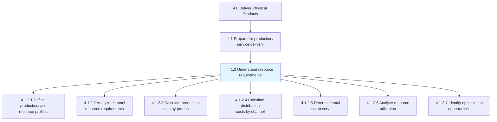
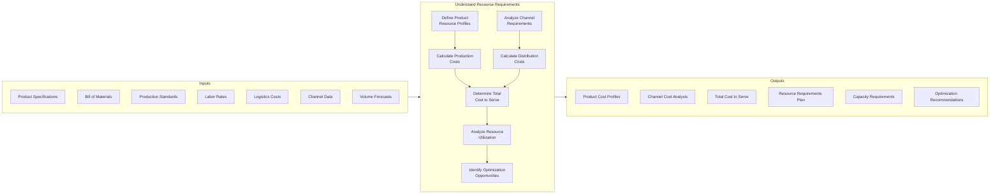
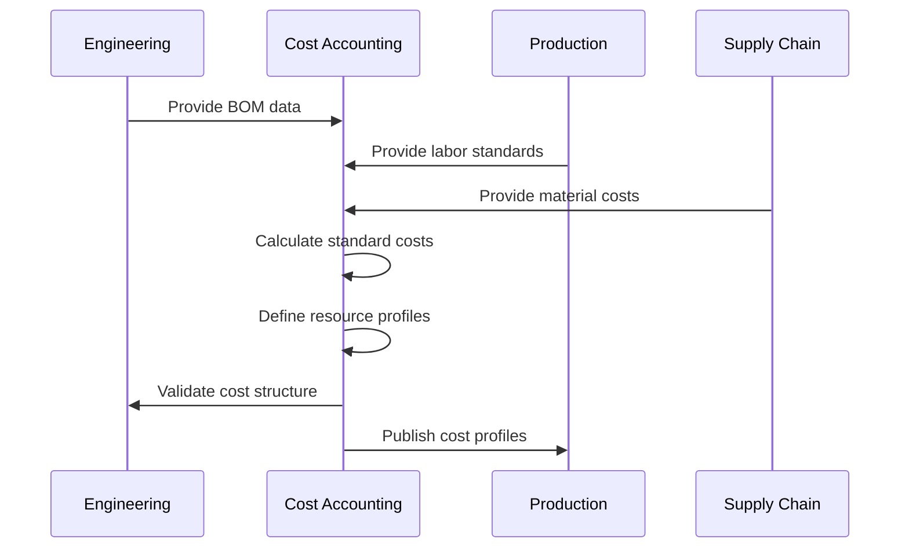
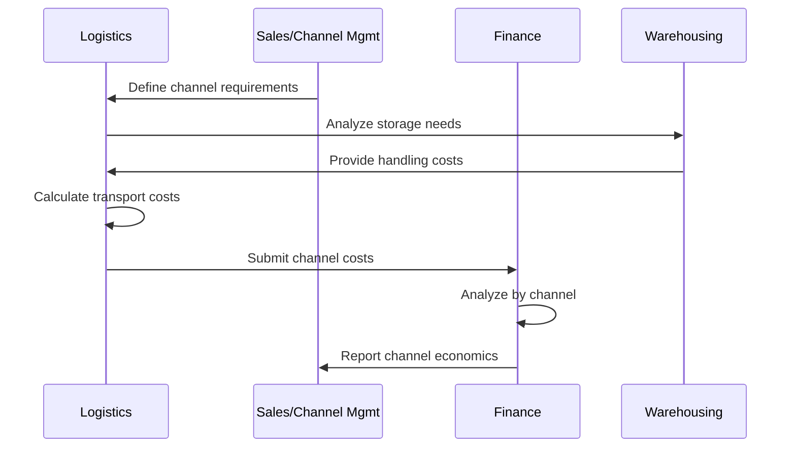
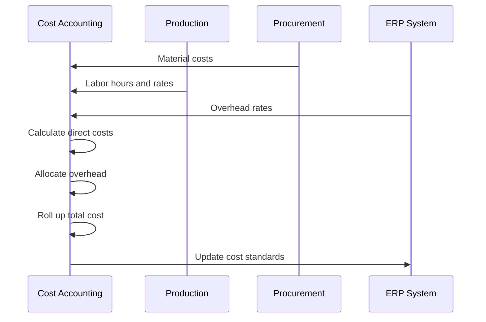
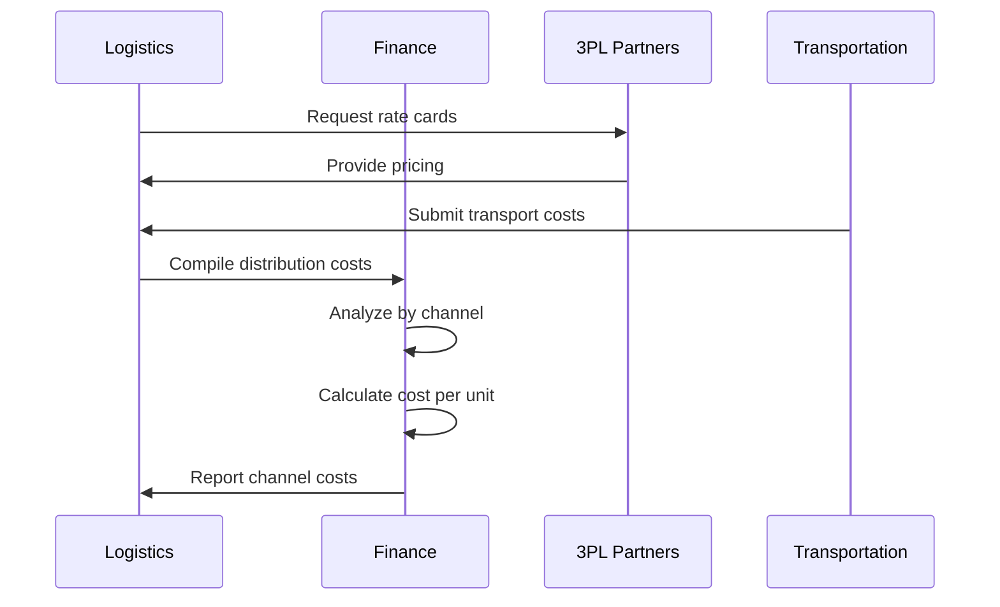
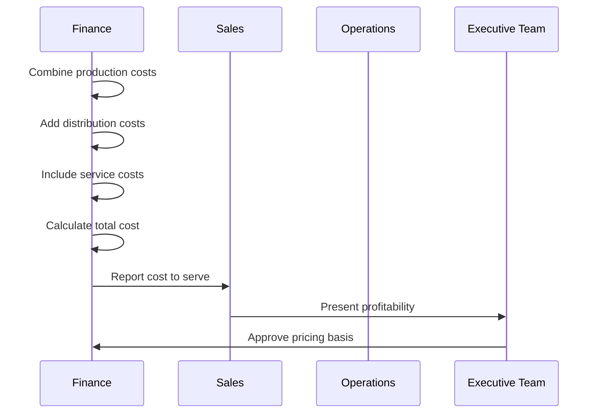
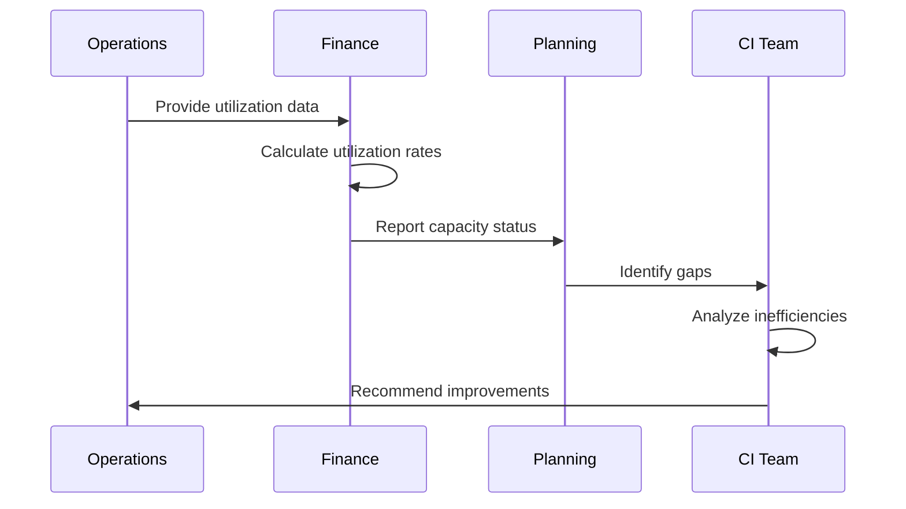
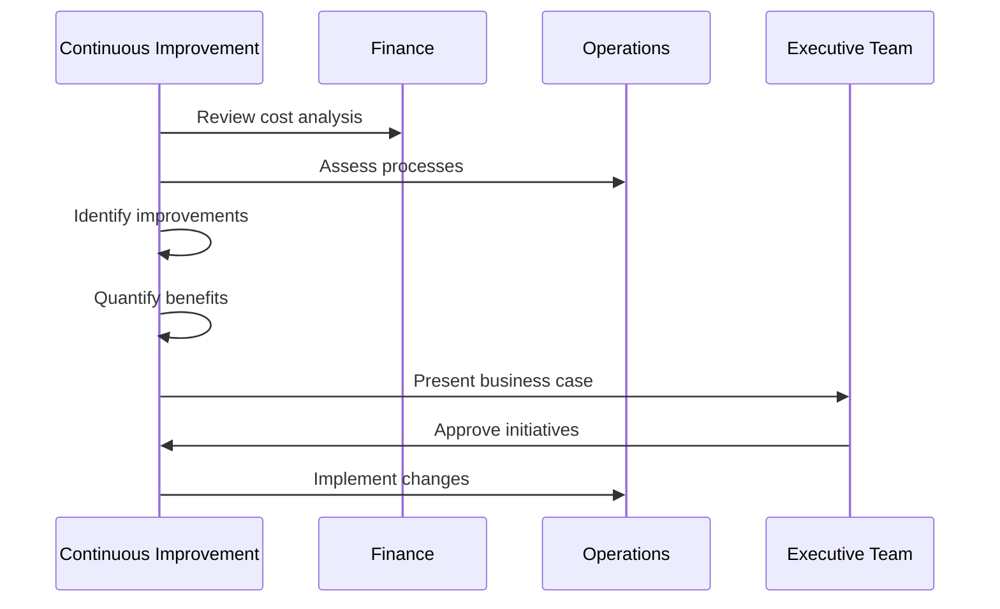
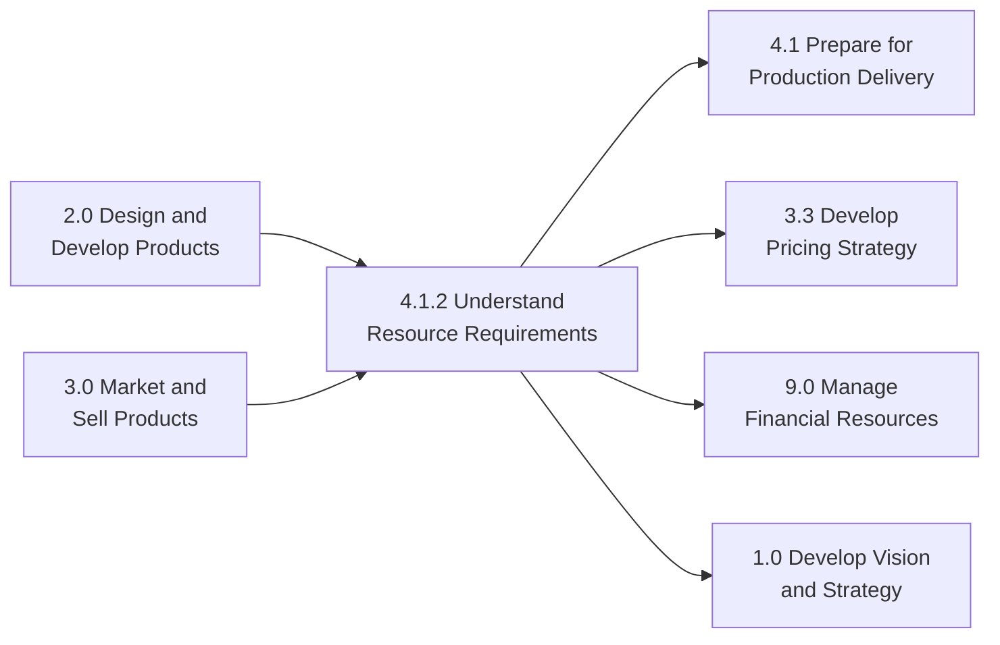

# Understand resource requirements for each product/service and delivery channel/method

> Determining the production and distribution costs for each product or service, and each channel or method as factors in determining overall pricing. This process analyzes the labor, materials, equipment, and logistics resources required to deliver products through various channels and methods.

## Overview

Understand resource requirements (APQC 4.1.2) is a critical planning process that quantifies the resources needed to produce and deliver products or services through various channels. This analysis forms the foundation for capacity planning, cost management, and pricing decisions. Understanding these requirements enables organizations to optimize resource allocation, identify cost reduction opportunities, and make informed channel strategy decisions.

This process integrates data from production, logistics, sales, and finance to create a comprehensive view of resource consumption across the product portfolio and delivery network. It supports both strategic planning decisions and tactical operational adjustments.

## Process Hierarchy



## Key Statistics

| Metric | Value |
|--------|-------|
| APQC Code | 20009 |
| Hierarchy ID | 4.1.2 |
| Level | Process |
| Category | [Deliver Physical Products](/processes/04-Delivery) |
| Parent Process | [Prepare for production delivery](/processes/04-Delivery/DeliveryPrep) |
| Activities | 7 |

## Process Flow



## GraphDL Semantic Structure

```
understand.ResourceRequirements.for.ProductAndDeliveryChannel
```

| Component | Value | Description |
|-----------|-------|-------------|
| Verb | `understand` | Action of analyzing and determining |
| Object | `ResourceRequirements` | Labor, materials, equipment, logistics needs |
| Preposition | `for` | Purpose relationship |
| PrepObject | `ProductAndDeliveryChannel` | Products and distribution methods |

## Activities

### 4.1.2.1 - Define product/service resource profiles

Creating detailed profiles of the resources required to produce each product or service, including materials, labor, equipment time, and overhead.



**Tasks:**
- `analyze.BillOfMaterials` - Review material requirements
- `define.LaborStandards` - Establish time and skill requirements
- `calculate.EquipmentUtilization` - Determine machine time needs
- `allocate.OverheadCosts` - Assign indirect costs
- `create.ProductCostProfile` - Document complete resource profile

### 4.1.2.2 - Analyze channel resource requirements

Evaluating the resources needed to deliver products through each distribution channel, including warehousing, transportation, and handling requirements.



**Tasks:**
- `map.DistributionChannels` - Document all delivery paths
- `analyze.WarehouseRequirements` - Determine storage needs by channel
- `calculate.TransportationCosts` - Evaluate shipping requirements
- `assess.HandlingRequirements` - Analyze touch points and labor
- `document.ChannelResourceProfile` - Create channel cost profiles

### 4.1.2.3 - Calculate production costs by product

Computing the full cost of production for each product, including direct materials, direct labor, and manufacturing overhead.



**Tasks:**
- `calculate.DirectMaterialCosts` - Sum material expenses
- `calculate.DirectLaborCosts` - Compute labor expenses
- `allocate.ManufacturingOverhead` - Distribute indirect costs
- `determine.VariableVsFixedCosts` - Classify cost components
- `establish.StandardProductCosts` - Set cost standards

### 4.1.2.4 - Calculate distribution costs by channel

Determining the costs associated with delivering products through each distribution channel, from finished goods inventory to customer delivery.



**Tasks:**
- `calculate.WarehouseCosts` - Determine storage expenses
- `calculate.TransportationCosts` - Compute shipping costs
- `analyze.LastMileDeliveryCosts` - Evaluate final delivery expenses
- `assess.ChannelPartnerCosts` - Include distributor/retailer costs
- `determine.CostPerUnitByChannel` - Calculate unit economics

### 4.1.2.5 - Determine total cost to serve

Combining production and distribution costs to calculate the complete cost of delivering each product to customers through each channel.



**Tasks:**
- `integrate.ProductionCosts` - Consolidate manufacturing costs
- `integrate.DistributionCosts` - Consolidate logistics costs
- `add.CustomerServiceCosts` - Include support costs
- `calculate.TotalCostToServe` - Sum all cost components
- `analyze.CostToServeBySegment` - Segment customer analysis

### 4.1.2.6 - Analyze resource utilization

Evaluating how effectively resources are being used across production and distribution operations to identify capacity constraints and inefficiencies.



**Tasks:**
- `measure.EquipmentUtilization` - Track machine usage
- `measure.LaborUtilization` - Monitor workforce productivity
- `analyze.WarehouseCapacity` - Evaluate storage utilization
- `assess.TransportationEfficiency` - Review logistics performance
- `identify.CapacityConstraints` - Find bottlenecks

### 4.1.2.7 - Identify optimization opportunities

Finding opportunities to reduce costs, improve efficiency, or better utilize resources in production and distribution operations.



**Tasks:**
- `identify.CostReductionOpportunities` - Find savings potential
- `analyze.ProcessImprovements` - Evaluate efficiency gains
- `assess.ChannelOptimization` - Review distribution options
- `evaluate.MakeVsBuyDecisions` - Analyze sourcing alternatives
- `develop.OptimizationRoadmap` - Plan improvement initiatives

## RACI Matrix

| Activity | Responsible | Accountable | Consulted | Informed |
|----------|-------------|-------------|-----------|----------|
| Define resource profiles | Cost Accounting | Controller | Engineering, Production | Operations |
| Analyze channel requirements | Logistics | VP Supply Chain | Sales, Warehouse | Finance |
| Calculate production costs | Cost Accounting | Controller | Production, Purchasing | Operations |
| Calculate distribution costs | Logistics Finance | VP Supply Chain | 3PL, Transportation | Sales |
| Determine total cost to serve | Finance | CFO | Operations, Sales | Executive Team |
| Analyze utilization | Operations | VP Operations | Finance, Planning | Executive Team |
| Identify optimization | CI Team | VP Operations | Finance, Operations | Executive Team |

## Related Departments

- [Finance/Cost Accounting](/departments/Finance) - Cost analysis and reporting
- [Supply Chain](/departments/SupplyChain) - Logistics cost management
- [Operations](/departments/Operations) - Resource utilization analysis
- [Manufacturing](/departments/Manufacturing) - Production cost data
- [Sales](/departments/Sales) - Channel strategy input
- [Procurement](/departments/Procurement) - Material cost information

## Related Occupations

- [Cost Accountants](/occupations/CostAccountants) - Product and channel costing
- [Financial Analysts](/occupations/FinancialAnalysts) - Cost analysis and modeling
- [Industrial Engineers](/occupations/IndustrialEngineers) - Process efficiency analysis
- [Logisticians](/occupations/Logisticians) - Distribution cost analysis
- [Operations Research Analysts](/occupations/OperationsResearchAnalysts) - Optimization modeling
- [Supply Chain Analysts](/occupations/SupplyChainAnalysts) - End-to-end cost analysis

## Industry Variations

### Manufacturing

Manufacturing focuses on detailed bill of materials costing, standard cost development, and variance analysis. Activity-based costing (ABC) helps allocate overhead to products accurately.

**Industry-Specific Activities:**
- Develop standard cost systems
- Perform variance analysis (price, usage, efficiency)
- Calculate equipment cost per hour
- Analyze product mix profitability
- Model make vs. buy decisions

### Retail

Retail resource analysis emphasizes distribution center costs, last-mile delivery economics, and omnichannel cost allocation. Store fulfillment vs. DC fulfillment cost comparison is critical.

**Industry-Specific Activities:**
- Compare store vs. DC fulfillment costs
- Analyze last-mile delivery options
- Calculate inventory carrying costs by location
- Evaluate vendor direct-ship economics
- Assess returns processing costs

### Consumer Products

Consumer products companies analyze trade spend, promotional costs, and complex distribution networks. Customer profitability analysis is essential for trade partner negotiations.

**Industry-Specific Activities:**
- Calculate cost to serve by customer
- Analyze trade promotion effectiveness
- Evaluate private label vs. branded margins
- Assess new product launch costs
- Model promotional lift vs. cost

### Automotive

Automotive resource analysis includes complex tier-supplier costs, tooling amortization, and program lifecycle costing. Platform and variant costing supports product planning.

**Industry-Specific Activities:**
- Develop platform-based costing
- Analyze variant cost complexity
- Calculate tooling cost allocation
- Model supplier logistics costs
- Evaluate localization economics

### Life Sciences

Life sciences requires activity-based costing for regulatory compliance, batch costing, and quality cost tracking. Cold chain logistics adds significant distribution complexity.

**Industry-Specific Activities:**
- Calculate batch production costs
- Analyze quality and compliance costs
- Model cold chain distribution costs
- Evaluate serialization costs
- Assess clinical trial supply costs

### E-Commerce / Direct-to-Consumer

E-commerce focuses on fulfillment center costs, shipping rate optimization, and customer acquisition costs. Unit economics analysis drives channel strategy.

**Industry-Specific Activities:**
- Calculate cost per order by channel
- Analyze shipping cost vs. revenue
- Evaluate fulfillment network options
- Model subscription economics
- Assess customer lifetime value vs. acquisition cost

## Sub-Processes

| Process | Code | Description |
|---------|------|-------------|
| Define product resource profiles | 4.1.2.1 | Creating detailed resource requirements |
| Analyze channel requirements | 4.1.2.2 | Evaluating distribution channel resources |
| Calculate production costs | 4.1.2.3 | Computing manufacturing costs |
| Calculate distribution costs | 4.1.2.4 | Determining logistics costs |
| Determine total cost to serve | 4.1.2.5 | Calculating complete delivery costs |

## Related Processes



## Metrics & KPIs

| Metric | Description | Target |
|--------|-------------|--------|
| Cost Accuracy | Variance between standard and actual costs | <5% |
| Cost to Serve | Total delivery cost per unit/order | Benchmark |
| Gross Margin | Revenue minus cost of goods sold | >30% |
| Distribution Cost % | Distribution cost as % of sales | <8% |
| Labor Productivity | Output per labor hour | Improving |
| Equipment Utilization | Productive time vs. available time | 80-85% |
| Overhead Absorption | Actual vs. budgeted overhead | Within 5% |
| Cost Reduction | Year-over-year cost improvement | 3-5% |

---

*Source: APQC PCF 20009 (4.1.2) - Cross-Industry*
