# Install and validate production/service delivery process

> Finalizing production process or methodology. Install and initiate the production process to manufacture the new products, using the equipment and machinery already assembled. In the case of new services, implement delivery processes and methodologies. Validate processes for the accuracy of their operation and proper functioning.

## Overview

Install and validate production/service delivery process (APQC 4.1.1) ensures that new or modified production processes are properly implemented and verified before full-scale operations begin. This critical process bridges the gap between product development and production, ensuring that manufacturing capabilities align with product specifications and quality requirements.

Validation encompasses installation qualification (IQ), operational qualification (OQ), and performance qualification (PQ) to demonstrate that equipment and processes consistently produce output meeting predetermined specifications. This process is essential for maintaining product quality, regulatory compliance, and operational efficiency.

## Process Hierarchy

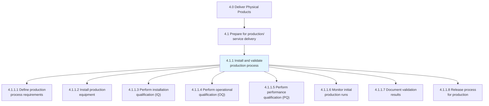

## Key Statistics

| Metric | Value |
|--------|-------|
| APQC Code | 10100 |
| Hierarchy ID | 4.1.1 |
| Level | Process |
| Category | [Deliver Physical Products](/processes/04-Delivery) |
| Parent Process | [Prepare for production delivery](/processes/04-Delivery/DeliveryPrep) |
| Activities | 8 |

## Process Flow

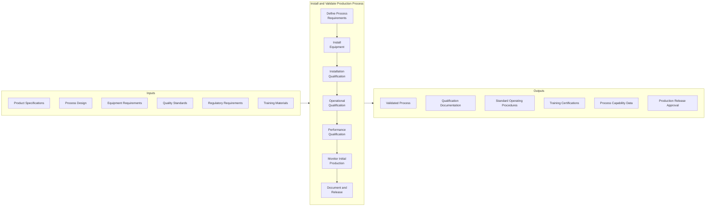

## GraphDL Semantic Structure

```
install.ProductionProcess.and.validate.DeliveryProcess
```

| Component | Value | Description |
|-----------|-------|-------------|
| Verb | `install` | Primary action of implementing |
| Object | `ProductionProcess` | Manufacturing system or methodology |
| Preposition | `and` | Conjunction linking actions |
| PrepObject | `validate.DeliveryProcess` | Secondary action of verification |

## Activities

### 4.1.1.1 - Define production process requirements

Documenting the specifications, parameters, and acceptance criteria that the production process must meet to ensure consistent product quality.

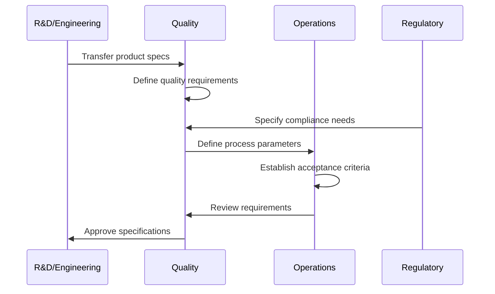

**Tasks:**
- `define.ProcessParameters` - Establish critical process parameters
- `establish.AcceptanceCriteria` - Set pass/fail criteria for qualification
- `document.ProductSpecifications` - Record product requirements
- `identify.CriticalQualityAttributes` - Determine key quality measures
- `create.ValidationProtocol` - Develop validation testing plan

### 4.1.1.2 - Install production equipment

Setting up and integrating production equipment, machinery, and systems according to design specifications and manufacturer requirements.

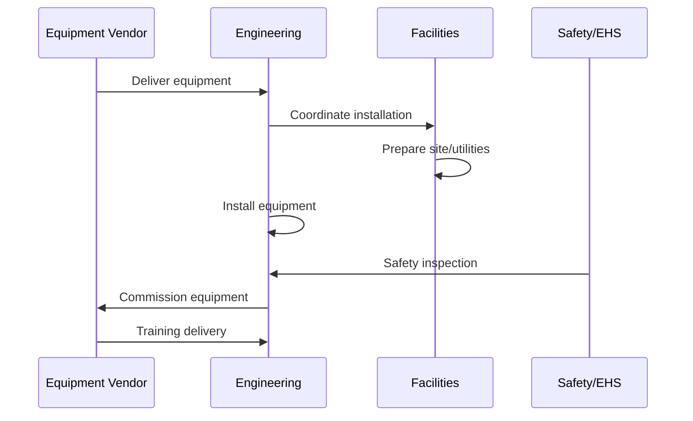

**Tasks:**
- `prepare.InstallationSite` - Ready physical location for equipment
- `install.ProductionEquipment` - Set up machinery and systems
- `connect.Utilities` - Integrate power, water, air, and data
- `configure.EquipmentParameters` - Set initial operating parameters
- `conduct.SafetyInspection` - Verify safety requirements

### 4.1.1.3 - Perform installation qualification (IQ)

Verifying that equipment is installed correctly according to specifications and manufacturer recommendations.

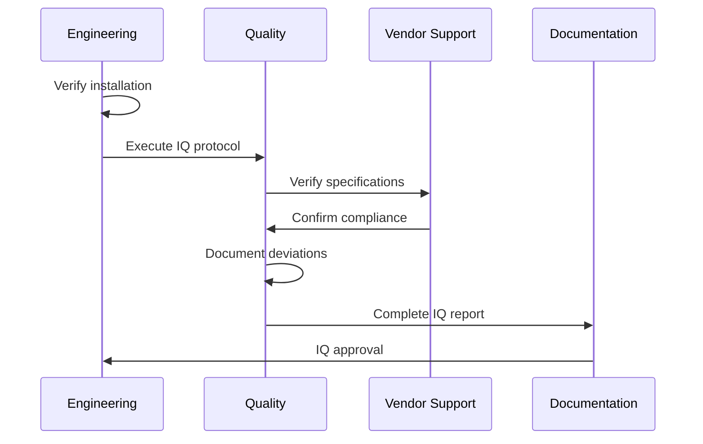

**Tasks:**
- `verify.EquipmentInstallation` - Confirm proper installation
- `check.UtilityConnections` - Verify infrastructure connections
- `review.DocumentationPackage` - Validate equipment documentation
- `calibrate.Instruments` - Calibrate measurement devices
- `document.IQResults` - Record installation qualification outcomes

### 4.1.1.4 - Perform operational qualification (OQ)

Demonstrating that equipment operates within specified parameters under normal and worst-case conditions.

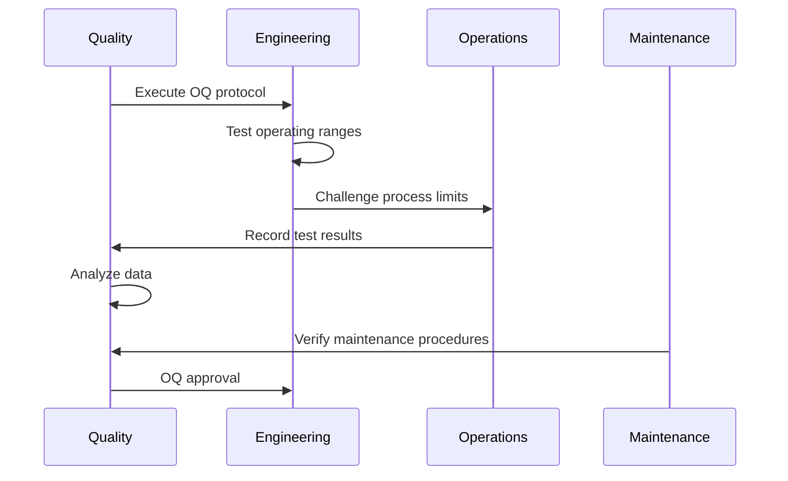

**Tasks:**
- `test.OperatingParameters` - Verify operational ranges
- `challenge.ProcessLimits` - Test boundary conditions
- `verify.AlarmFunctions` - Confirm safety interlocks
- `test.ControlSystems` - Validate automation controls
- `document.OQResults` - Record operational qualification outcomes

### 4.1.1.5 - Perform performance qualification (PQ)

Proving that the production process consistently produces product meeting quality specifications under actual production conditions.

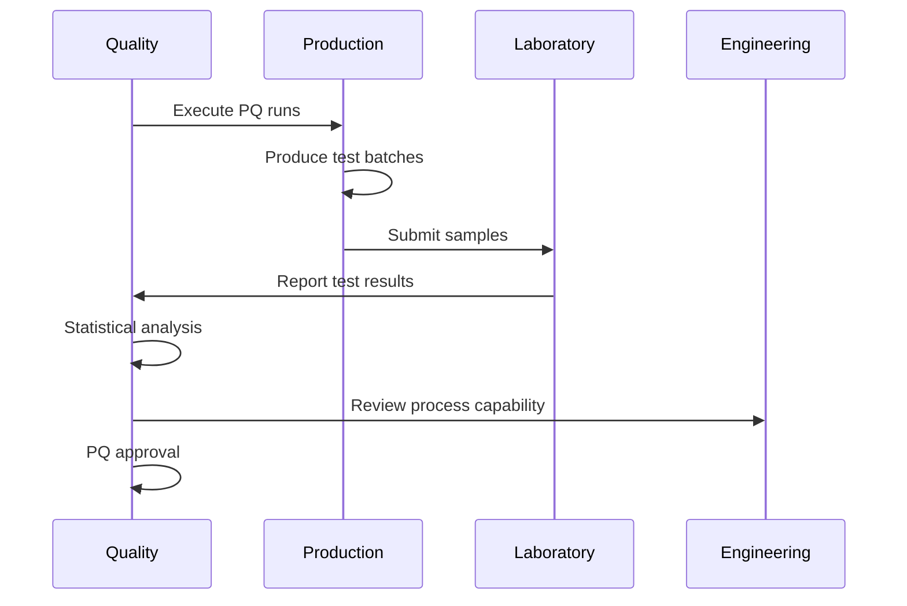

**Tasks:**
- `execute.ProductionTrials` - Run qualification batches
- `sample.ProductOutput` - Collect samples for testing
- `analyze.ProcessCapability` - Calculate Cpk and other metrics
- `verify.ProductQuality` - Confirm product meets specifications
- `document.PQResults` - Record performance qualification outcomes

### 4.1.1.6 - Monitor initial production runs

Closely tracking early production to identify and address any issues before full-scale operations.

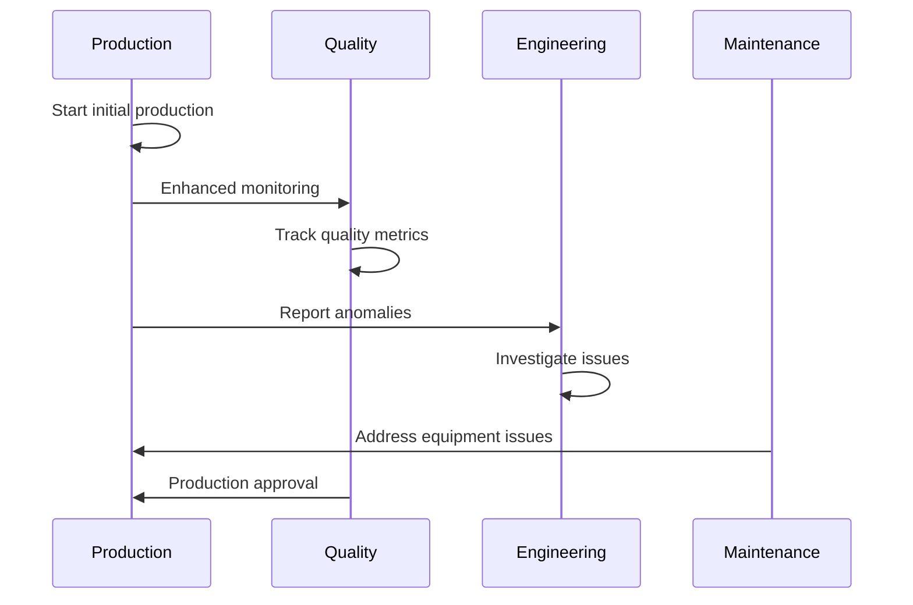

**Tasks:**
- `monitor.InitialProductionRuns` - Track early production performance
- `collect.ProcessData` - Gather operational metrics
- `identify.ProcessVariations` - Detect and analyze deviations
- `implement.Corrections` - Make necessary adjustments
- `verify.ProcessStability` - Confirm consistent operation

### 4.1.1.7 - Document validation results

Creating comprehensive documentation of all validation activities, results, and approvals for regulatory compliance and future reference.

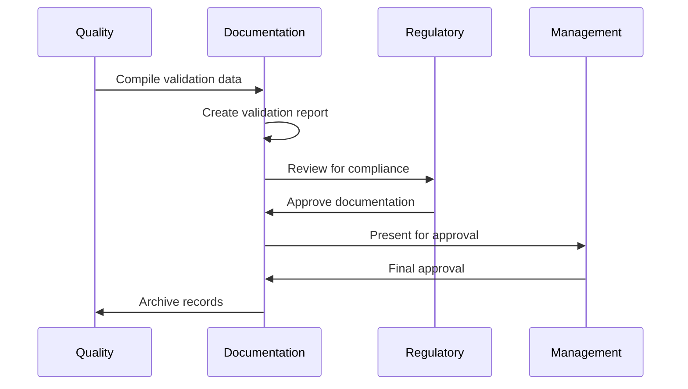

**Tasks:**
- `compile.ValidationData` - Gather all test results
- `create.ValidationReport` - Prepare comprehensive documentation
- `address.Deviations` - Document and resolve variances
- `obtain.Approvals` - Secure required sign-offs
- `archive.ValidationRecords` - Store documentation properly

### 4.1.1.8 - Release process for production

Formally approving the validated process for routine production use and transitioning to normal operations.

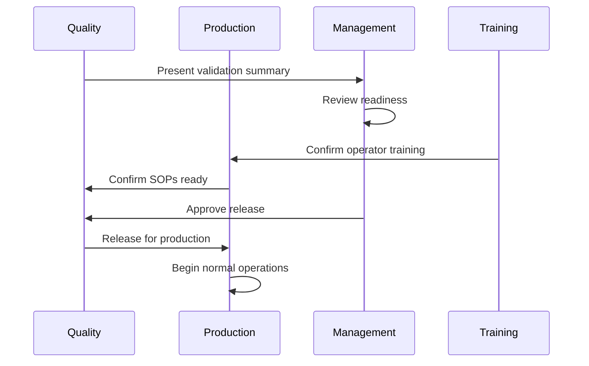

**Tasks:**
- `conduct.ReadinessReview` - Assess production readiness
- `verify.TrainingCompletion` - Confirm operator qualifications
- `finalize.SOPs` - Approve operating procedures
- `issue.ProductionRelease` - Formally authorize production
- `transition.ToNormalOperations` - Hand off to production team

## RACI Matrix

| Activity | Responsible | Accountable | Consulted | Informed |
|----------|-------------|-------------|-----------|----------|
| Define process requirements | Engineering | Quality Director | R&D, Regulatory | Production |
| Install equipment | Engineering | Plant Manager | Vendors, Facilities | Quality |
| Installation qualification | Quality | Quality Director | Engineering, Vendors | Management |
| Operational qualification | Quality | Quality Director | Engineering, Production | Management |
| Performance qualification | Quality | Quality Director | Production, Lab | Management |
| Monitor initial runs | Production | Plant Manager | Quality, Engineering | Management |
| Document results | Quality | Quality Director | Engineering, Regulatory | All Stakeholders |
| Release for production | Quality | VP Operations | Production, Management | All Departments |

## Related Departments

- [Quality Assurance](/departments/Quality) - Validation execution and approval
- [Engineering](/departments/Engineering) - Equipment installation and qualification
- [Manufacturing](/departments/Manufacturing) - Production trials and monitoring
- [Regulatory Affairs](/departments/Regulatory) - Compliance verification
- [R&D](/departments/RD) - Product specification transfer
- [Facilities](/departments/Facilities) - Site preparation and utilities

## Related Occupations

- [Quality Engineers](/occupations/QualityEngineers) - Validation protocol development
- [Process Engineers](/occupations/ProcessEngineers) - Process design and optimization
- [Manufacturing Engineers](/occupations/ManufacturingEngineers) - Equipment installation
- [Validation Specialists](/occupations/ValidationSpecialists) - Qualification execution
- [Production Supervisors](/occupations/ProductionSupervisors) - Initial production monitoring
- [Quality Control Technicians](/occupations/QualityControlTechnicians) - Testing and inspection

## Industry Variations

### Life Sciences / Pharmaceutical

Life sciences validation follows strict FDA 21 CFR Part 211 and EU GMP Annex 15 requirements. Documentation must support regulatory submissions and inspections. Computer system validation (CSV) is required for automated systems.

**Industry-Specific Activities:**
- Execute IQ/OQ/PQ according to GAMP 5
- Validate computer systems per 21 CFR Part 11
- Conduct cleaning validation
- Perform process validation with three consecutive batches
- Document per regulatory submission requirements

### Automotive

Automotive validation follows IATF 16949 requirements with emphasis on PPAP (Production Part Approval Process), capability studies, and FMEA (Failure Mode and Effects Analysis). Run-at-rate validation demonstrates production capability.

**Industry-Specific Activities:**
- Complete Production Part Approval Process (PPAP)
- Conduct run-at-rate studies
- Perform measurement system analysis (MSA)
- Execute Design/Process FMEA
- Validate statistical process control (SPC)

### Aerospace and Defense

Aerospace validation requires AS9100 compliance, first article inspection (FAI), and extensive documentation. Special processes require NADCAP accreditation. Traceability to raw materials is essential.

**Industry-Specific Activities:**
- Complete First Article Inspection (FAI)
- Validate special processes per NADCAP
- Document material traceability
- Qualify to customer-specific requirements
- Maintain AS9100 compliance records

### Food and Beverage

Food manufacturing validation emphasizes HACCP (Hazard Analysis Critical Control Points), sanitary design, and allergen control. FDA FSMA (Food Safety Modernization Act) compliance is required.

**Industry-Specific Activities:**
- Validate HACCP critical control points
- Qualify sanitation procedures
- Validate allergen control processes
- Perform thermal process validation
- Document FSMA compliance

### Electronics

Electronics validation focuses on ESD (electrostatic discharge) controls, environmental requirements, and automated optical inspection. IPC standards govern acceptance criteria.

**Industry-Specific Activities:**
- Validate ESD controls
- Qualify solder processes per IPC
- Validate automated optical inspection (AOI)
- Perform cleanliness testing
- Document component traceability

### Consumer Products

Consumer products validation balances speed to market with quality requirements. Focus on aesthetic quality, packaging validation, and shelf-life testing.

**Industry-Specific Activities:**
- Validate high-speed packaging lines
- Perform stability and shelf-life testing
- Qualify label and print quality
- Validate fill weight accuracy
- Document consumer safety testing

## Sub-Processes

| Process | Code | Description |
|---------|------|-------------|
| Define process requirements | 4.1.1.1 | Documenting specifications and criteria |
| Install production equipment | 4.1.1.2 | Setting up and integrating equipment |
| Perform IQ | 4.1.1.3 | Installation qualification activities |
| Perform OQ | 4.1.1.4 | Operational qualification activities |
| Perform PQ | 4.1.1.5 | Performance qualification activities |

## Related Processes

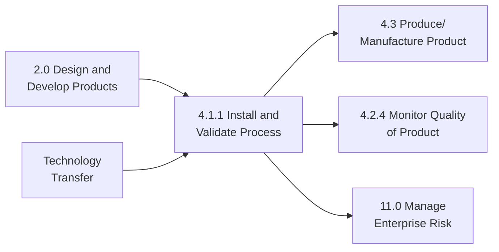

## Metrics & KPIs

| Metric | Description | Target |
|--------|-------------|--------|
| First Pass Yield | Products passing validation on first attempt | >95% |
| Validation Cycle Time | Time from start to process release | Per plan |
| Deviation Rate | Number of deviations during validation | <5% |
| Process Capability (Cpk) | Statistical measure of process capability | >1.33 |
| On-Time Validation | Validation completed per schedule | >90% |
| Requalification Rate | Processes requiring revalidation | <10% |
| Documentation Completeness | Validation records meeting requirements | 100% |
| Training Completion | Operators trained before release | 100% |

---

*Source: APQC PCF 10100 (4.1.1) - Cross-Industry*
