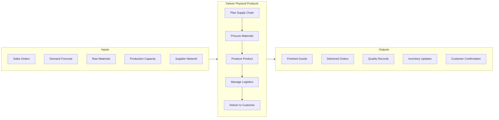
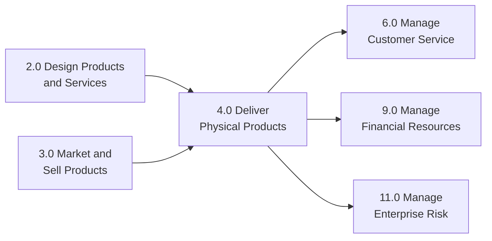

# Deliver Physical Products

> Managing all activities related to the production and delivery of physical goods to customers. This category encompasses planning for production, procuring materials, producing products, managing logistics and warehousing, and delivering products to customers while ensuring quality throughout the supply chain.

## Overview

Deliver Physical Products (APQC Category 4.0) represents the core operational processes that transform raw materials and components into finished goods and ensure their delivery to customers. This category is critical for any organization that manufactures, assembles, or distributes physical products. It covers the entire journey from production planning through final delivery, including quality assurance at every stage.

The processes within this category require tight coordination between supply chain planning, procurement, manufacturing, warehousing, and logistics functions. Effective execution of these processes directly impacts customer satisfaction, operational costs, and competitive advantage.

## Process Hierarchy

```mermaid
graph TD
    C4["4.0 Deliver Physical Products"] --> G41["4.1 Plan for and align<br/>supply chain resources"]
    C4 --> G42["4.2 Procure materials<br/>and services"]
    C4 --> G43["4.3 Produce/Manufacture/<br/>Deliver product"]
    C4 --> G44["4.4 Manage logistics<br/>and warehousing"]

    G41 --> P411["4.1.1 Develop production<br/>and materials strategies"]
    G41 --> P412["4.1.2 Manage demand<br/>for products"]
    G41 --> P413["4.1.3 Create materials plan"]
    G41 --> P414["4.1.4 Create master<br/>production schedule"]
    G41 --> P415["4.1.5 Plan distribution<br/>requirements"]

    G42 --> P421["4.2.1 Develop sourcing<br/>strategies"]
    G42 --> P422["4.2.2 Select suppliers and<br/>develop contracts"]
    G42 --> P423["4.2.3 Order materials<br/>and services"]
    G42 --> P424["4.2.4 Manage suppliers"]

    G43 --> P431["4.3.1 Schedule production"]
    G43 --> P432["4.3.2 Produce/Assemble product"]
    G43 --> P433["4.3.3 Perform quality testing"]
    G43 --> P434["4.3.4 Maintain production records"]

    G44 --> P441["4.4.1 Provide logistics governance"]
    G44 --> P442["4.4.2 Plan inbound material flow"]
    G44 --> P443["4.4.3 Operate warehousing"]
    G44 --> P444["4.4.4 Operate outbound transportation"]
    G44 --> P445["4.4.5 Manage reverse logistics"]

    style C4 fill:#e3f2fd
```



## Key Statistics

| Metric | Value |
|--------|-------|
| APQC Code | 4.0 |
| Hierarchy ID | 4.0 |
| Level | Category |
| Process Groups | 4 |
| Total Sub-Processes | 75+ |
| Cross-Industry Applicability | High |

## GraphDL Semantic Structure

```graphdl
deliver.PhysicalProducts
```

| Component | Value | Description |
|-----------|-------|-------------|
| Verb | `deliver` | Primary action of providing and transporting |
| Object | `PhysicalProducts` | Tangible goods manufactured or distributed |
| Preposition | - | Not applicable at category level |
| PrepObject | - | Not applicable at category level |

## Processes in this Category

| Process | Code | Description |
|---------|------|-------------|
| [Prepare for production/service delivery](./DeliveryPrep) | 4.1 | Planning production capacity, resources, and delivery methods |
| [Install and validate production/service delivery process](./ValidationProcess) | 4.1.1 | Implementing and validating manufacturing processes |
| [Understand resource requirements](./ResourceRequirements) | 4.1.2 | Analyzing resource needs for products and channels |
| [Monitor quality of product delivered](./QualityMonitoring) | 4.2.4 | Tracking supplier and product quality performance |
| [Pick, pack, and ship product for delivery](./PickPackShip) | 4.4.3 | Warehouse operations for order fulfillment |

## Process Flow



## RACI Matrix

| Activity | Responsible | Accountable | Consulted | Informed |
|----------|-------------|-------------|-----------|----------|
| Plan supply chain | Supply Chain Planning | VP Operations | Sales, Finance | Executive Team |
| Procure materials | Procurement Team | CPO | Quality, Production | Finance |
| Produce product | Production Team | Plant Manager | Engineering, Quality | Supply Chain |
| Manage logistics | Logistics Team | VP Supply Chain | Warehousing, Transport | Sales |
| Monitor quality | Quality Team | Quality Director | Production, Suppliers | Customers |

## Related Departments

- [Operations](/departments/Operations/index) - Overall production and delivery management
- [Supply Chain](/departments/SupplyChain/index) - Planning and coordination
- [Procurement](/departments/Procurement) - Material sourcing and supplier management
- [Manufacturing](/departments/Operations) - Production execution
- [Logistics](/departments/SupplyChain) - Transportation and warehousing
- [Quality Assurance](/departments/Quality) - Quality control and assurance

## Related Occupations

- [Industrial Production Managers](/occupations/Management/IndustrialProductionManagers) - Production oversight
- [Logisticians](/occupations/Business/Logisticians) - Supply chain coordination
- [Purchasing Managers](/occupations/Management/PurchasingManagers) - Procurement leadership
- [Quality Control Inspectors](/occupations/QualityControlInspectors) - Quality verification
- [Transportation Managers](/occupations/TransportationManagers) - Logistics management
- [Warehouse Managers](/occupations/WarehouseManagers) - Storage and distribution

## Industry Variations

### Manufacturing

Manufacturing industries implement comprehensive production systems (MES, ERP) with detailed shop floor control, batch tracking, and integrated quality management. Focus on lean manufacturing, just-in-time delivery, and continuous improvement.

### Retail

Retail focuses heavily on distribution center operations, omnichannel fulfillment, last-mile delivery optimization, and inventory management across multiple locations. Peak season planning and rapid fulfillment are critical.

### Automotive

Automotive delivery processes emphasize just-in-sequence delivery, supplier quality management, component traceability, and complex assembly line coordination. Strong focus on defect prevention and supplier development.

### Consumer Products

Consumer products companies balance mass production with customization, manage complex distribution networks, and optimize shelf-life sensitive inventory. Promotional and seasonal planning is critical.

### Life Sciences

Life sciences delivery requires cold chain logistics, regulatory compliance (GMP), batch traceability, and quality documentation for every shipment. Validation and documentation requirements are extensive.

## Related Processes



## Metrics & KPIs

| Metric | Description | Target |
|--------|-------------|--------|
| On-Time Delivery | Percentage of orders delivered on schedule | >95% |
| Perfect Order Rate | Orders delivered complete, on-time, damage-free | >90% |
| Inventory Turnover | Times inventory is sold and replaced annually | Industry benchmark |
| Order Cycle Time | Time from order receipt to delivery | <48 hours |
| Production Yield | Percentage of products meeting quality standards | >99% |
| Supplier Quality Rate | Percentage of materials meeting specifications | >98% |
| Warehouse Accuracy | Inventory accuracy rate | >99.5% |
| Logistics Cost | Transportation and warehousing cost as % of revenue | <5% |

---

*Source: APQC PCF 4.0 - Cross-Industry*
