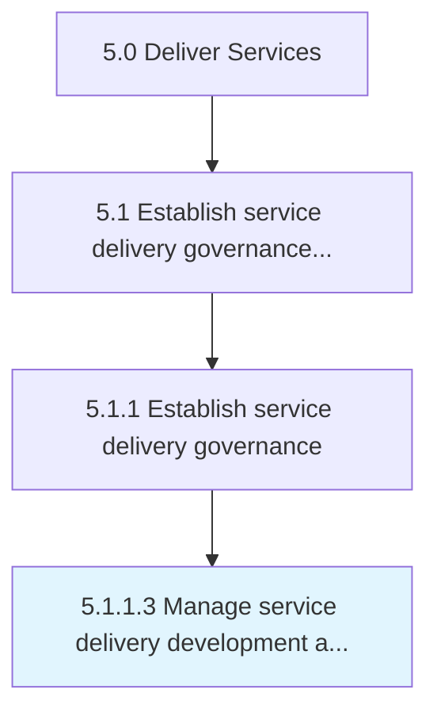

# Manage service delivery development and direction

> Providing guidance of resources to ensure that the development and direction of service delivery is in line with customer needs.

## Overview

Activity 5.1.1.3 is an activity within the Deliver Services framework. 

Providing guidance of resources to ensure that the development and direction of service delivery is in line with customer needs.

## Process Hierarchy



## Key Statistics

| Metric | Value |
|--------|-------|
| APQC Code | 20030 |
| Hierarchy ID | 5.1.1.3 |
| Level | Activity |
| Parent | [5.1.1](../) |
| Sub-Processes | 0 |


## GraphDL Semantic Structure

```
manage.ServiceDeliveryDevelopmentAndDirection
```

| Component | Value | Description |
|-----------|-------|-------------|
| Verb | `manage` | Primary action |
| Object | `service delivery development and direction` | Direct object |


## Related Concepts

- [ServiceDeliveryDevelopment](/concepts/ServiceDeliveryDevelopment)
- [Direction](/concepts/Direction)


---

*Source: APQC PCF 20030 (5.1.1.3) - APQC*
