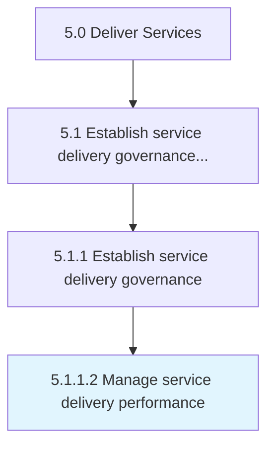

# Manage service delivery performance

> Conducting and implementing performance measures to ensure successful delivery of service to the customer.

## Overview

Activity 5.1.1.2 is an activity within the Deliver Services framework. 

Conducting and implementing performance measures to ensure successful delivery of service to the customer.

## Process Hierarchy



## Key Statistics

| Metric | Value |
|--------|-------|
| APQC Code | 20029 |
| Hierarchy ID | 5.1.1.2 |
| Level | Activity |
| Parent | [5.1.1](../) |
| Sub-Processes | 0 |


## GraphDL Semantic Structure

```
manage.ServiceDeliveryPerformance
```

| Component | Value | Description |
|-----------|-------|-------------|
| Verb | `manage` | Primary action |
| Object | `service delivery performance` | Direct object |


## Related Concepts

- [ServiceDeliveryPerformance](/concepts/ServiceDeliveryPerformance)


---

*Source: APQC PCF 20029 (5.1.1.2) - APQC*
