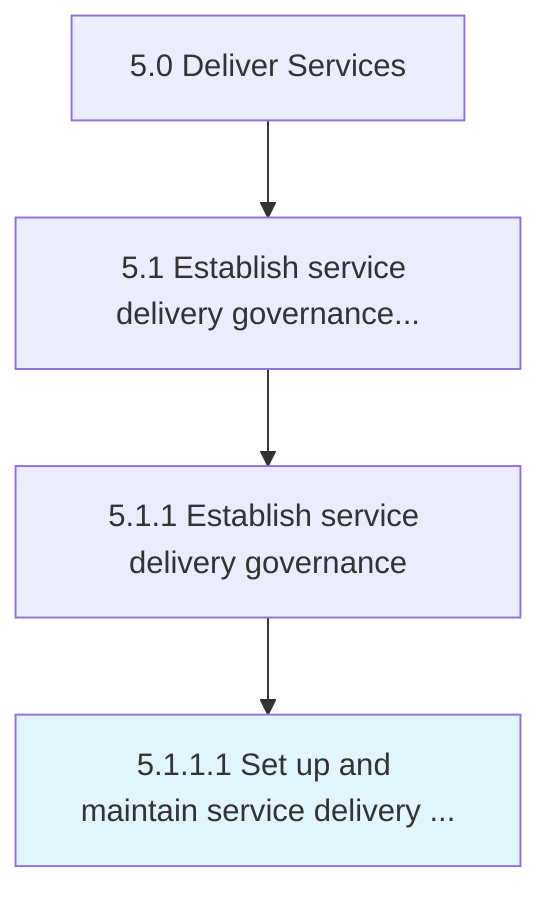

# Set up and maintain service delivery governance and management system

> Providing a system for which to manage customer needs and a structure for which to facilitate service delivery to fulfill those needs.

## Overview

Activity 5.1.1.1 is an activity within the Deliver Services framework. 

Providing a system for which to manage customer needs and a structure for which to facilitate service delivery to fulfill those needs.

## Process Hierarchy



## Key Statistics

| Metric | Value |
|--------|-------|
| APQC Code | 20028 |
| Hierarchy ID | 5.1.1.1 |
| Level | Activity |
| Parent | [5.1.1](../) |
| Sub-Processes | 0 |


## GraphDL Semantic Structure

```
set.UpAndMaintainServiceDeliveryGovernanceAndManagementSystem
```

| Component | Value | Description |
|-----------|-------|-------------|
| Verb | `set` | Primary action |
| Object | `up and maintain service delivery governance and management system` | Direct object |


## Related Concepts

- MaintainServiceDeliveryGovernanceSystem
- ManagementSystem


---

*Source: APQC PCF 20028 (5.1.1.1) - APQC*
