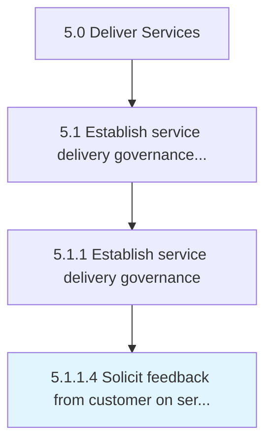

# Solicit feedback from customer on service delivery satisfaction

> Engaging the customer post delivery to gauge the effectiveness of services rendered in order to improve on key delivery functions going forward.

## Overview

Activity 5.1.1.4 is an activity within the Deliver Services framework. 

Engaging the customer post delivery to gauge the effectiveness of services rendered in order to improve on key delivery functions going forward.

## Process Hierarchy



## Key Statistics

| Metric | Value |
|--------|-------|
| APQC Code | 20031 |
| Hierarchy ID | 5.1.1.4 |
| Level | Activity |
| Parent | [5.1.1](../) |
| Sub-Processes | 0 |


## GraphDL Semantic Structure

```
solicit.Feedback.from.CustomerOnServiceDeliverySatisfaction
```

| Component | Value | Description |
|-----------|-------|-------------|
| Verb | `solicit` | Primary action |
| Object | `feedback` | Direct object |
| Preposition | `from` | Relationship |
| PrepObject | `customer on service delivery satisfaction` | Indirect object |


## Related Concepts

- [Feedback](/concepts/Feedback)
- [CustomerOnServiceDeliverySatisfaction](/concepts/CustomerOnServiceDeliverySatisfaction)


---

*Source: APQC PCF 20031 (5.1.1.4) - APQC*
