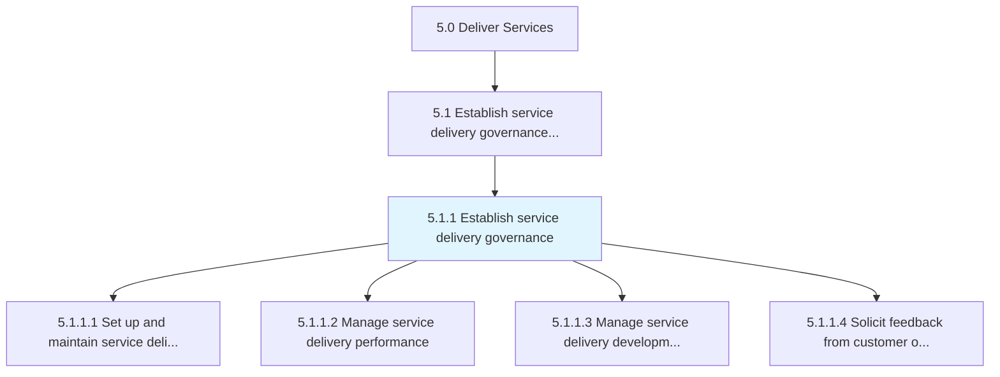
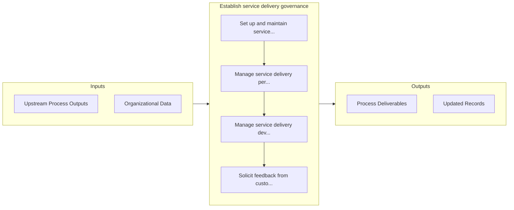

# Establish service delivery governance

> Establishing service delivery governance through a system that manages performance, development, and direction.

## Overview

Process 5.1.1 is a core process that defines the specific procedures for establish service delivery governance. 

Establishing service delivery governance through a system that manages performance, development, and direction. Allow for customer feedback on delivery satisfaction.

## Process Hierarchy



## Key Statistics

| Metric | Value |
|--------|-------|
| APQC Code | 20027 |
| Hierarchy ID | 5.1.1 |
| Level | Process |
| Parent | [5.1](../) |
| Sub-Processes | 4 |


## GraphDL Semantic Structure

```graphdl
establish.ServiceDeliveryGovernance
```

| Component | Value | Description |
|-----------|-------|-------------|
| Verb | `establish` | Primary action |
| Object | `service delivery governance` | Direct object |


## Process Flow



## Sub-Processes

| Process | Hierarchy ID | Description |
|---------|-------------|-------------|
| [Set up and maintain service delivery governance and management system](./SetUpAndMaintainServiceDeliveryGovernanceAndManagementSystem) | 5.1.1.1 | Providing a system for which to manage customer needs and a structure for which to facilitate servic |
| [Manage service delivery performance](./ManageServiceDeliveryPerformance) | 5.1.1.2 | Conducting and implementing performance measures to ensure successful delivery of service to the cus |
| [Manage service delivery development and direction](./ManageServiceDeliveryDevelopmentAndDirection) | 5.1.1.3 | Providing guidance of resources to ensure that the development and direction of service delivery is  |
| [Solicit feedback from customer on service delivery satisfaction](./SolicitFeedbackFromCustomerOnServiceDeliverySatisfaction) | 5.1.1.4 | Engaging the customer post delivery to gauge the effectiveness of services rendered in order to impr |


## Related Concepts

- ServiceDeliveryGovernance


---

*Source: APQC PCF 20027 (5.1.1) - APQC*
