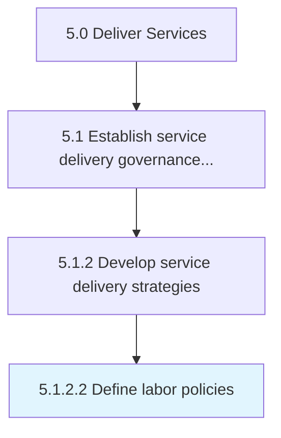

# Define labor policies

> Outlining labor policies for resources and ensuring that those policies meet the needs of the organization, the customer, and government regulations.

## Overview

Activity 5.1.2.2 is an activity within the Deliver Services framework. 

Outlining labor policies for resources and ensuring that those policies meet the needs of the organization, the customer, and government regulations.

## Process Hierarchy



## Key Statistics

| Metric | Value |
|--------|-------|
| APQC Code | 20034 |
| Hierarchy ID | 5.1.2.2 |
| Level | Activity |
| Parent | [5.1.2](../) |
| Sub-Processes | 0 |


## GraphDL Semantic Structure

```
define.LaborPolicies
```

| Component | Value | Description |
|-----------|-------|-------------|
| Verb | `define` | Primary action |
| Object | `labor policies` | Direct object |


## Related Concepts

- [LaborPolicies](/concepts/LaborPolicies)


---

*Source: APQC PCF 20034 (5.1.2.2) - APQC*
