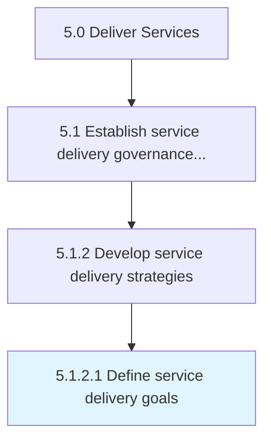

# Define service delivery goals

> Aligning organization practices to meet the needs of the customer by creating service delivery goals.

## Overview

Activity 5.1.2.1 is an activity within the Deliver Services framework. 

Aligning organization practices to meet the needs of the customer by creating service delivery goals.

## Process Hierarchy



## Key Statistics

| Metric | Value |
|--------|-------|
| APQC Code | 20033 |
| Hierarchy ID | 5.1.2.1 |
| Level | Activity |
| Parent | [5.1.2](../) |
| Sub-Processes | 0 |


## GraphDL Semantic Structure

```
define.ServiceDeliveryGoals
```

| Component | Value | Description |
|-----------|-------|-------------|
| Verb | `define` | Primary action |
| Object | `service delivery goals` | Direct object |


## Related Concepts

- ServiceDeliveryGoals


---

*Source: APQC PCF 20033 (5.1.2.1) - APQC*
