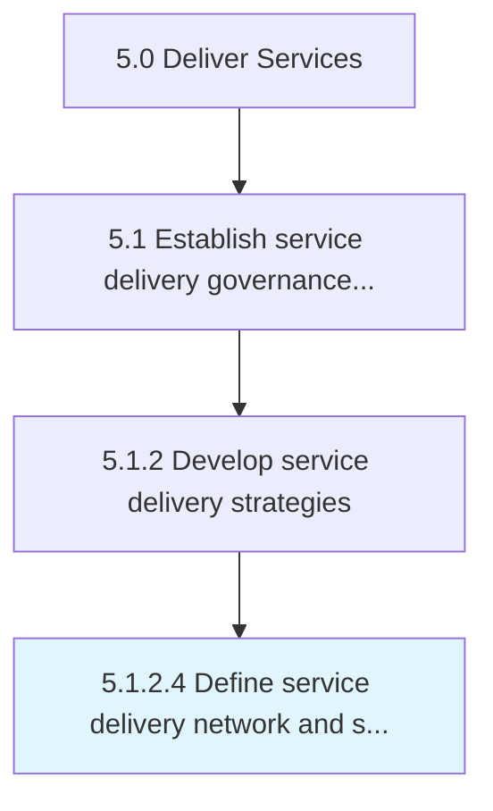

# Define service delivery network and supply constraints

> Identifying and understanding the limitations imposed upon service delivery network and supply.

## Overview

Activity 5.1.2.4 is an activity within the Deliver Services framework. 

Identifying and understanding the limitations imposed upon service delivery network and supply.

## Process Hierarchy



## Key Statistics

| Metric | Value |
|--------|-------|
| APQC Code | 20036 |
| Hierarchy ID | 5.1.2.4 |
| Level | Activity |
| Parent | [5.1.2](../) |
| Sub-Processes | 0 |


## GraphDL Semantic Structure

```
define.ServiceDeliveryNetworkAndSupplyConstraints
```

| Component | Value | Description |
|-----------|-------|-------------|
| Verb | `define` | Primary action |
| Object | `service delivery network and supply constraints` | Direct object |


## Related Concepts

- ServiceDeliveryNetwork
- SupplyConstraints


---

*Source: APQC PCF 20036 (5.1.2.4) - APQC*
