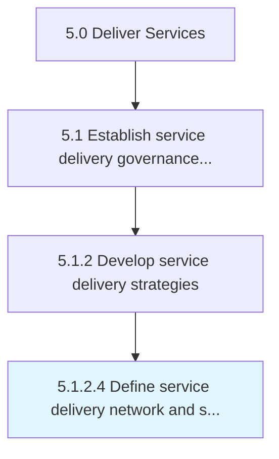
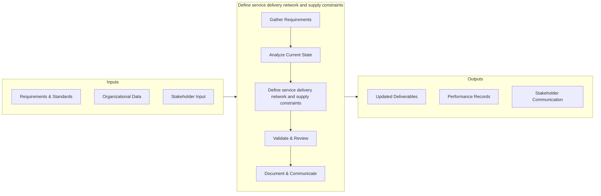

# Define service delivery network and supply constraints

> Identifying and understanding the limitations imposed upon service delivery network and supply.

## Overview

This activity encompasses the end-to-end process of define service delivery network and supply constraints within the service delivery and governance domain. It involves coordinating cross-functional teams, applying standardized methodologies, and leveraging organizational data to ensure consistent and effective outcomes. The process is aligned with the broader Deliver Services framework (APQC 5.1.2.4) and supports strategic objectives by translating operational requirements into actionable procedures.

Effective execution of this activity requires clear ownership, well-defined inputs and outputs, and continuous monitoring against established benchmarks. Organizations that excel at this process typically integrate it with upstream planning activities and downstream performance measurement, creating a feedback loop that drives ongoing improvement and adaptation to changing business conditions.


## Process Hierarchy



## Key Statistics

| Metric | Value |
|--------|-------|
| APQC Code | 20036 |
| Hierarchy ID | 5.1.2.4 |
| Level | Activity |
| Parent | [5.1.2](../) |
| Sub-Processes | 0 |


## GraphDL Semantic Structure

```graphdl
define.ServiceDeliveryNetworkAndSupplyConstraints
```

| Component | Value | Description |
|-----------|-------|-------------|
| Verb | `define` | Primary action |
| Object | `service delivery network and supply constraints` | Direct object |


## Process Flow



## RACI Matrix

| Activity | Service Delivery Manager | Operations Director | Quality Assurance Team | Business Development |
|----------|:-:|:-:|:-:|:-:|
| Gather Requirements | R | A | C | I |
| Analyze Current State | R | I | C | I |
| Define service delivery network and supply constraints | R | A | C | I |
| Validate & Review | C | A | R | I |
| Document & Communicate | R | I | I | C |

## Related Occupations

- [Service Delivery Manager](/occupations/ServiceDeliveryManagers)
- [Operations Manager](/occupations/Management/OperationsManagers)
- [Business Analyst](/occupations/BusinessAnalysts)
- [Quality Assurance Specialist](/occupations/QualityAssuranceSpecialists)

## Related Departments

- Service Operations
- Business Development
- Quality Management

## Industry Variations

### Professional Services
Focus on billable utilization, client engagement models, and knowledge management across consulting and advisory practices.

### Healthcare
Emphasis on patient outcomes, regulatory compliance (HIPAA), and care coordination across multidisciplinary teams.

### Financial Services
Prioritization of risk management, regulatory adherence, and digital transformation of client-facing services.

## KPIs & Metrics

| KPI | Description | Unit |
|-----|-------------|------|
| Cycle Time | Average time to complete define service delivery network and supply constraints process | Hours/Days |
| Completion Rate | Percentage of service delivery network and supply constraints activities completed on schedule | % |
| Quality Score | Accuracy and quality rating of service delivery network and supply constraints outputs | 1-10 Scale |
| Cost Efficiency | Cost per unit of service delivery network and supply constraints processed | $/Unit |
| Service Level Agreement (SLA) Compliance | Percentage of activities meeting SLA targets | % |

## Related Concepts

- ServiceDeliveryNetwork
- SupplyConstraints


---

*Source: APQC PCF 20036 (5.1.2.4) - APQC*
