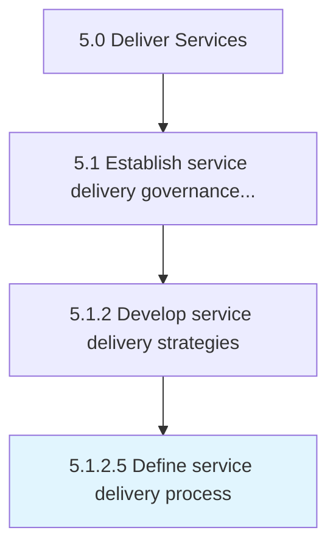

# Define service delivery process

> Defanging policies and procedures that focus on meeting the needs and expectations of the customer within the working parameters of the organization.

## Overview

Activity 5.1.2.5 is an activity within the Deliver Services framework. 

Defanging policies and procedures that focus on meeting the needs and expectations of the customer within the working parameters of the organization.

## Process Hierarchy



## Key Statistics

| Metric | Value |
|--------|-------|
| APQC Code | 20037 |
| Hierarchy ID | 5.1.2.5 |
| Level | Activity |
| Parent | [5.1.2](../) |
| Sub-Processes | 0 |


## GraphDL Semantic Structure

```
define.ServiceDeliveryProcess
```

| Component | Value | Description |
|-----------|-------|-------------|
| Verb | `define` | Primary action |
| Object | `service delivery process` | Direct object |


## Related Concepts

- ServiceDeliveryProcess


---

*Source: APQC PCF 20037 (5.1.2.5) - APQC*
