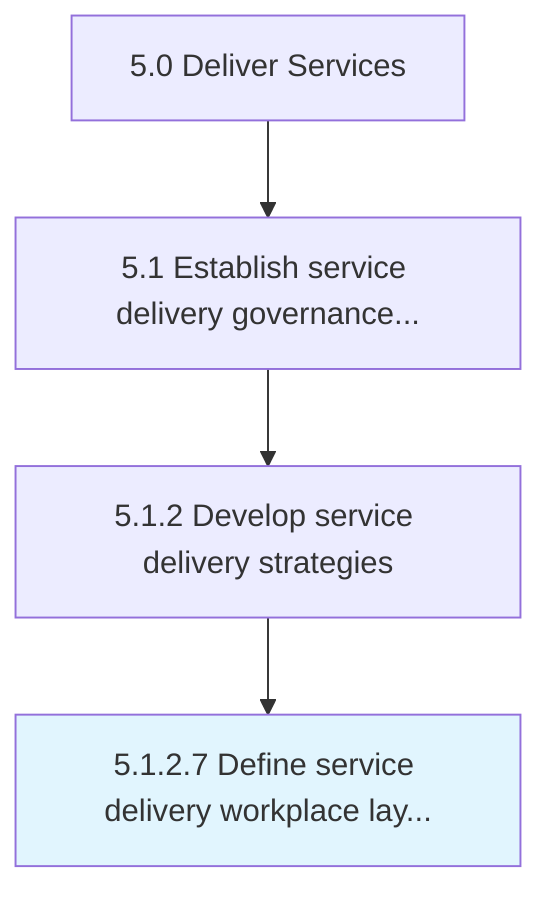

# Define service delivery workplace layout and infrastructure

> Creating a workplace that best serves the needs of the organization and customer through strategic layout and infrastructure.

## Overview

Activity 5.1.2.7 is an activity within the Deliver Services framework. 

Creating a workplace that best serves the needs of the organization and customer through strategic layout and infrastructure.

## Process Hierarchy



## Key Statistics

| Metric | Value |
|--------|-------|
| APQC Code | 20039 |
| Hierarchy ID | 5.1.2.7 |
| Level | Activity |
| Parent | [5.1.2](../) |
| Sub-Processes | 0 |


## GraphDL Semantic Structure

```
define.ServiceDeliveryWorkplaceLayoutAndInfrastructure
```

| Component | Value | Description |
|-----------|-------|-------------|
| Verb | `define` | Primary action |
| Object | `service delivery workplace layout and infrastructure` | Direct object |


## Related Concepts

- ServiceDeliveryWorkplaceLayout
- Infrastructure


---

*Source: APQC PCF 20039 (5.1.2.7) - APQC*
