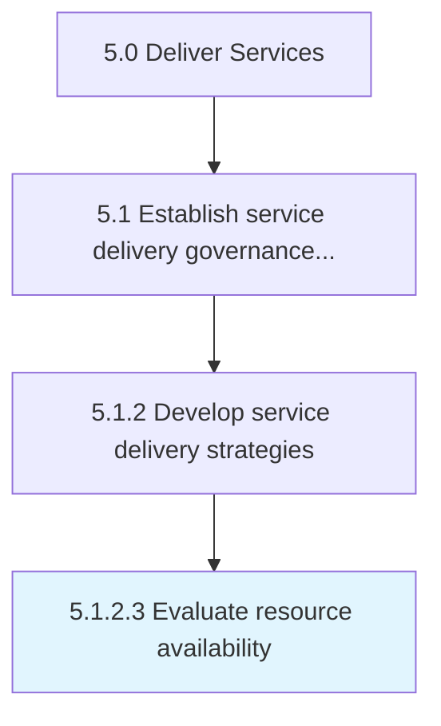

# Evaluate resource availability

> Understanding the needs of the customer and providing the necessary resources to meet those requirements.

## Overview

Activity 5.1.2.3 is an activity within the Deliver Services framework. 

Understanding the needs of the customer and providing the necessary resources to meet those requirements.

## Process Hierarchy



## Key Statistics

| Metric | Value |
|--------|-------|
| APQC Code | 20035 |
| Hierarchy ID | 5.1.2.3 |
| Level | Activity |
| Parent | [5.1.2](../) |
| Sub-Processes | 0 |


## GraphDL Semantic Structure

```
evaluate.ResourceAvailability
```

| Component | Value | Description |
|-----------|-------|-------------|
| Verb | `evaluate` | Primary action |
| Object | `resource availability` | Direct object |


## Related Concepts

- [ResourceAvailability](/concepts/ResourceAvailability)


---

*Source: APQC PCF 20035 (5.1.2.3) - APQC*
