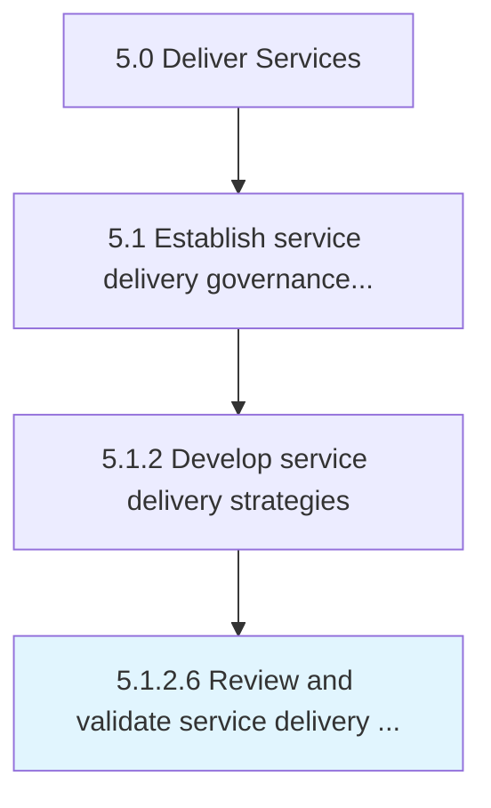

# Review and validate service delivery procedures

> Revisioning service delivery procedures that fall short of performance parameters.

## Overview

Activity 5.1.2.6 is an activity within the Deliver Services framework. 

Revisioning service delivery procedures that fall short of performance parameters. Realign procedures with specified expectations in order to provide successful service delivery.

## Process Hierarchy



## Key Statistics

| Metric | Value |
|--------|-------|
| APQC Code | 20038 |
| Hierarchy ID | 5.1.2.6 |
| Level | Activity |
| Parent | [5.1.2](../) |
| Sub-Processes | 0 |


## GraphDL Semantic Structure

```
review.AndValidateServiceDeliveryProcedures
```

| Component | Value | Description |
|-----------|-------|-------------|
| Verb | `review` | Primary action |
| Object | `and validate service delivery procedures` | Direct object |


## Related Concepts

- ServiceDeliveryProcedures
- ServiceDeliveryProcedures


---

*Source: APQC PCF 20038 (5.1.2.6) - APQC*
