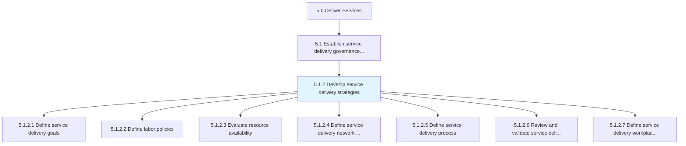
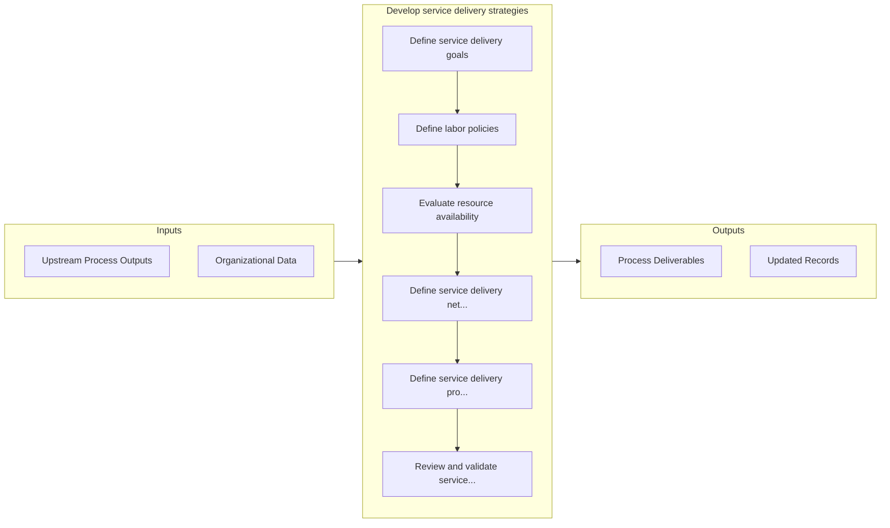

# Develop service delivery strategies

> Constructing strategies that identify goals, policies, processes, and procedures in relation to service delivery.

## Overview

Process 5.1.2 is a core process that defines the specific procedures for develop service delivery strategies. 

Constructing strategies that identify goals, policies, processes, and procedures in relation to service delivery. Review and validate strategies. Define the workplace layout and infrastructure.

## Process Hierarchy



## Key Statistics

| Metric | Value |
|--------|-------|
| APQC Code | 20032 |
| Hierarchy ID | 5.1.2 |
| Level | Process |
| Parent | [5.1](../) |
| Sub-Processes | 7 |


## GraphDL Semantic Structure

```graphdl
develop.ServiceDeliveryStrategies
```

| Component | Value | Description |
|-----------|-------|-------------|
| Verb | `develop` | Primary action |
| Object | `service delivery strategies` | Direct object |


## Process Flow



## Sub-Processes

| Process | Hierarchy ID | Description |
|---------|-------------|-------------|
| [Define service delivery goals](./DefineServiceDeliveryGoals) | 5.1.2.1 | Aligning organization practices to meet the needs of the customer by creating service delivery goals |
| [Define labor policies](./DefineLaborPolicies) | 5.1.2.2 | Outlining labor policies for resources and ensuring that those policies meet the needs of the organi |
| [Evaluate resource availability](./EvaluateResourceAvailability) | 5.1.2.3 | Understanding the needs of the customer and providing the necessary resources to meet those requirem |
| [Define service delivery network and supply constraints](./DefineServiceDeliveryNetworkAndSupplyConstraints) | 5.1.2.4 | Identifying and understanding the limitations imposed upon service delivery network and supply |
| [Define service delivery process](./DefineServiceDeliveryProcess) | 5.1.2.5 | Defanging policies and procedures that focus on meeting the needs and expectations of the customer w |
| [Review and validate service delivery procedures](./ReviewAndValidateServiceDeliveryProcedures) | 5.1.2.6 | Revisioning service delivery procedures that fall short of performance parameters |
| [Define service delivery workplace layout and infrastructure](./DefineServiceDeliveryWorkplaceLayoutAndInfrastructure) | 5.1.2.7 | Creating a workplace that best serves the needs of the organization and customer through strategic l |


## Related Concepts

- ServiceDeliveryStrategies


---

*Source: APQC PCF 20032 (5.1.2) - APQC*
