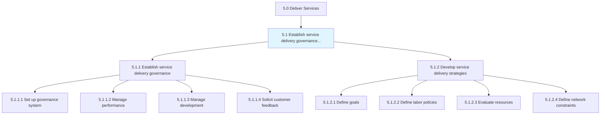
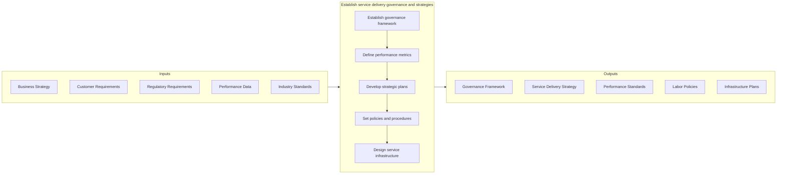
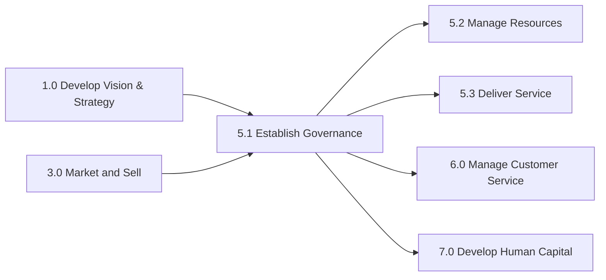

# Establish service delivery governance and strategies

> Creating rules and regulations for service delivery to the customer.

## Overview

Group 5.1 is a process group within APQC Category 5.0 (Deliver Services). This foundational process group establishes the governance frameworks and strategic direction required for effective service delivery across the organization.

Creating rules and regulations for service delivery to the customer. Establish a system to manage performance, delivery, and direction of service delivery. Engage with the customer for satisfaction feedback. Define goals, policies, processes, and workplace layout and infrastructure as a part of the service delivery strategy.

Effective service delivery governance ensures alignment between organizational objectives and customer expectations while providing the control mechanisms necessary for consistent, high-quality service outcomes. Strategic planning within this process group enables organizations to anticipate market changes, optimize resource allocation, and maintain competitive advantage through superior service capabilities.

## Process Hierarchy



## Key Statistics

| Metric | Value |
|--------|-------|
| APQC Code | 20026 |
| Hierarchy ID | 5.1 |
| Level | Group |
| Parent | [5](../) |
| Sub-Processes | 2 |
| Activities | 11 |
| Industry Variants | 19 |

## GraphDL Semantic Structure

```graphdl
establish.ServiceDeliveryGovernanceAndStrategies
```

| Component | Value | Description |
|-----------|-------|-------------|
| Verb | `establish` | Primary action of creating and implementing |
| Object | `service delivery governance and strategies` | Framework and plans for service delivery |

## Process Flow



## Child Process Listings

### 5.1.1 - Establish service delivery governance

Establishing service delivery governance through a system that manages performance, development, and direction. This process creates the management infrastructure required to oversee service operations, ensure quality standards, and drive continuous improvement.

**Key Activities:**
- Set up and maintain service delivery governance and management system (5.1.1.1)
- Manage service delivery performance (5.1.1.2)
- Manage service delivery development and direction (5.1.1.3)
- Solicit feedback from customer on service delivery satisfaction (5.1.1.4)

[View Process Details](./5.1.1-EstablishServiceDeliveryGovernance/)

### 5.1.2 - Develop service delivery strategies

Constructing strategies that identify goals, policies, processes, and procedures in relation to service delivery. This process translates organizational objectives into actionable service delivery plans.

**Key Activities:**
- Define service delivery goals (5.1.2.1)
- Define labor policies (5.1.2.2)
- Evaluate resource availability (5.1.2.3)
- Define service delivery network and supply constraints (5.1.2.4)
- Define service delivery process (5.1.2.5)
- Review and validate service delivery procedures (5.1.2.6)
- Define service delivery workplace layout and infrastructure (5.1.2.7)

[View Process Details](./5.1.2-DevelopServiceDeliveryStrategies/)

## RACI Matrix

| Activity | Service Delivery Manager | COO | Operations Director | Quality Manager | HR Director | Finance Director |
|----------|-------------------------|-----|---------------------|-----------------|-------------|------------------|
| Set up governance system | R | A | C | C | I | I |
| Manage service performance | R | A | R | C | I | C |
| Define service goals | R | A | C | C | I | C |
| Define labor policies | C | A | C | I | R | C |
| Evaluate resource availability | R | I | C | I | C | A |
| Define network constraints | R | A | R | I | I | C |
| Review procedures | R | A | C | R | I | I |
| Design infrastructure | C | A | R | C | I | R |

**Legend:** R = Responsible, A = Accountable, C = Consulted, I = Informed

## Metrics and KPIs

| Metric | Description | Target | Frequency |
|--------|-------------|--------|-----------|
| Governance Compliance Rate | Percentage of service operations adhering to governance standards | >95% | Monthly |
| Strategy Implementation Rate | Percentage of strategic initiatives successfully implemented | >85% | Quarterly |
| Policy Adherence Score | Compliance with established service delivery policies | >90% | Monthly |
| Customer Satisfaction Index | Average satisfaction rating from customer feedback | >4.2/5.0 | Monthly |
| Service Delivery Goal Achievement | Percentage of service delivery goals met | >90% | Quarterly |
| Time to Policy Update | Average time to update policies after identified need | <30 days | Per occurrence |
| Governance Review Completion | Percentage of scheduled governance reviews completed | 100% | Quarterly |
| Strategic Alignment Score | Alignment between service strategy and business objectives | >85% | Annual |

## Related Departments

- [Operations](/departments/Operations) - Primary execution of service delivery operations
- [Quality Assurance](/departments/Quality) - Service quality standards and compliance
- [Human Resources](/departments/HR) - Labor policy development and workforce planning
- [Finance](/departments/Finance) - Budget allocation and financial governance
- [Legal & Compliance](/departments/Legal) - Regulatory compliance and contract governance
- [Customer Success](/departments/CustomerSuccess) - Customer feedback and satisfaction management

## Related Occupations

- [General and Operations Managers](/occupations/Management/GeneralOperationsManagers) - Overall governance oversight
- [Management Analysts](/occupations/Business/Operations/ManagementAnalysts) - Strategy development and process improvement
- [Training and Development Managers](/occupations/Management/TrainingDevelopmentManagers) - Service capability development
- [Quality Control Managers](/occupations/Management/QualityControlManagers) - Service quality governance
- [Administrative Services Managers](/occupations/Management/AdministrativeServicesManagers) - Infrastructure and facilities planning
- [Compliance Officers](/occupations/Business/Compliance/ComplianceOfficers) - Regulatory governance

## Related Concepts

- ServiceDeliveryGovernance
- Strategies
- PerformanceManagement
- QualityStandards
- PolicyDevelopment
- ResourcePlanning

## Related Processes



---

*Source: APQC PCF 20026 (5.1) - APQC*
