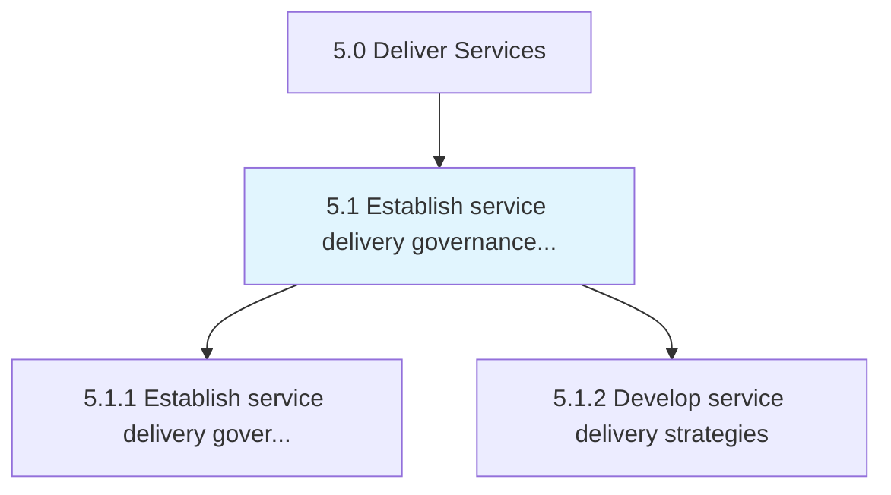
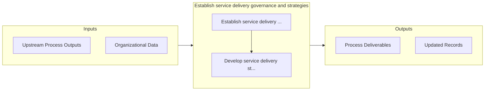

# Establish service delivery governance and strategies

> Creating rules and regulations for service delivery to the customer.

## Overview

Group 5.1 is a process group within APQC Category 5.0 (Deliver Services). 

Creating rules and regulations for service delivery to the customer. Establish a system to manage performance, delivery, and direction of service delivery. Engage with the customer for satisfaction feedback. Define goals, policies, processes, and workplace layout and infrastructure as a part of the service delivery strategy.

## Process Hierarchy



## Key Statistics

| Metric | Value |
|--------|-------|
| APQC Code | 20026 |
| Hierarchy ID | 5.1 |
| Level | Group |
| Parent | [5](../) |
| Sub-Processes | 2 |


## GraphDL Semantic Structure

```graphdl
establish.ServiceDeliveryGovernanceAndStrategies
```

| Component | Value | Description |
|-----------|-------|-------------|
| Verb | `establish` | Primary action |
| Object | `service delivery governance and strategies` | Direct object |


## Process Flow



## Sub-Processes

| Process | Hierarchy ID | Description |
|---------|-------------|-------------|
| [Establish service delivery governance](./5.1.1-EstablishServiceDeliveryGovernance/) | 5.1.1 | Establishing service delivery governance through a system that manages performance, development, and |
| [Develop service delivery strategies](./5.1.2-DevelopServiceDeliveryStrategies/) | 5.1.2 | Constructing strategies that identify goals, policies, processes, and procedures in relation to serv |


## Related Concepts

- ServiceDeliveryGovernance
- Strategies


---

*Source: APQC PCF 20026 (5.1) - APQC*
