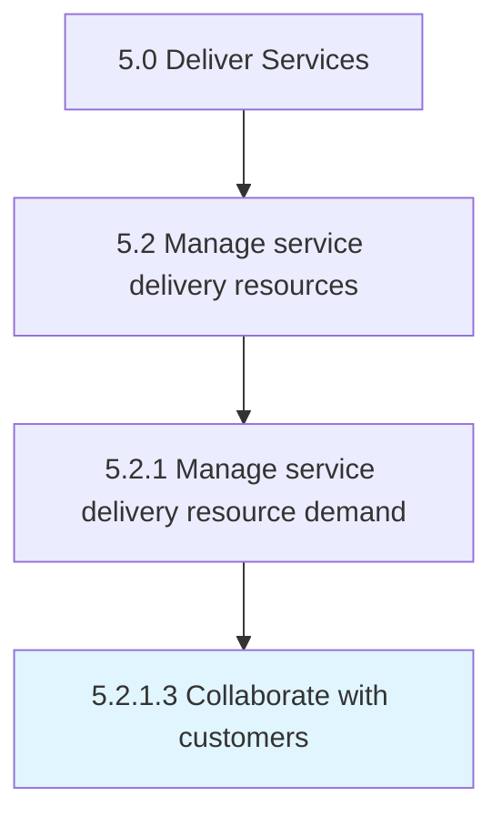

# Collaborate with customers

> Providing a collaborative meeting in which to engage the customer to understand the scope of their needs and constructing solutions based on need and constraints.

## Overview

Activity 5.2.1.3 is an activity within the Deliver Services framework. 

Providing a collaborative meeting in which to engage the customer to understand the scope of their needs and constructing solutions based on need and constraints.

## Process Hierarchy



## Key Statistics

| Metric | Value |
|--------|-------|
| APQC Code | 20044 |
| Hierarchy ID | 5.2.1.3 |
| Level | Activity |
| Parent | [5.2.1](../) |
| Sub-Processes | 0 |


## GraphDL Semantic Structure

```
collaborate.WithCustomers
```

| Component | Value | Description |
|-----------|-------|-------------|
| Verb | `collaborate` | Primary action |
| Object | `with customers` | Direct object |


## Related Concepts

- Customers


---

*Source: APQC PCF 20044 (5.2.1.3) - APQC*
