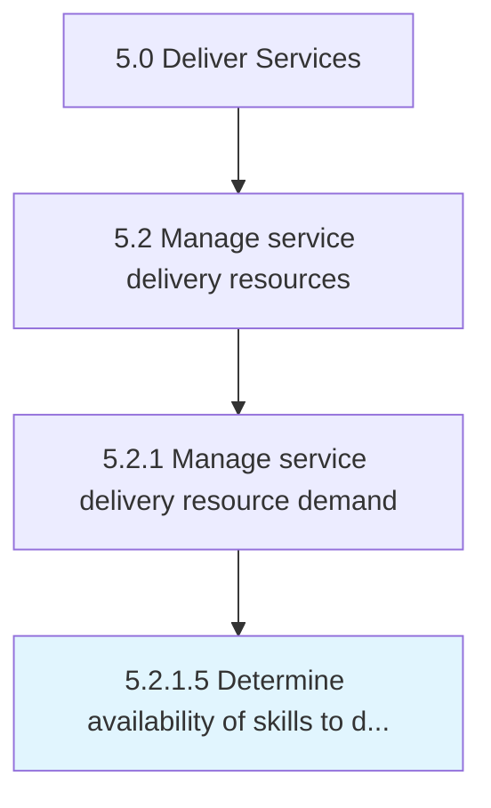

# Determine availability of skills to deliver on current and forecast customer orders

> Identifying what skillset is necessary for the delivery of opportunities.

## Overview

Activity 5.2.1.5 is an activity within the Deliver Services framework. 

Identifying what skillset is necessary for the delivery of opportunities. Determine the forecast of customer orders based upon those skillsets and the resources available.

## Process Hierarchy



## Key Statistics

| Metric | Value |
|--------|-------|
| APQC Code | 20046 |
| Hierarchy ID | 5.2.1.5 |
| Level | Activity |
| Parent | [5.2.1](../) |
| Sub-Processes | 0 |


## GraphDL Semantic Structure

```
determine.Availability.of.SkillsToDeliverOnCurrentAndForecastCustomerOrders
```

| Component | Value | Description |
|-----------|-------|-------------|
| Verb | `determine` | Primary action |
| Object | `availability` | Direct object |
| Preposition | `of` | Relationship |
| PrepObject | `skills to deliver on current and forecast customer orders` | Indirect object |


## Related Concepts

- [Availability](/concepts/Availability)
- [SkillsToDeliverOnCurrent](/concepts/SkillsToDeliverOnCurrent)
- [Availability](/concepts/Availability)
- [ForecastCustomerOrders](/concepts/ForecastCustomerOrders)


---

*Source: APQC PCF 20046 (5.2.1.5) - APQC*
