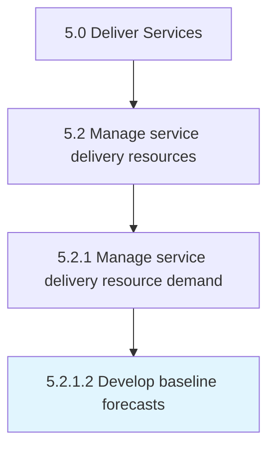

# Develop baseline forecasts

> Identifying the demand anticipated for the organization's services.

## Overview

Activity 5.2.1.2 is an activity within the Deliver Services framework. 

Identifying the demand anticipated for the organization's services. Estimate future demand for services using historical data, analysis of the market environment, and external data.

## Process Hierarchy



## Key Statistics

| Metric | Value |
|--------|-------|
| APQC Code | 20043 |
| Hierarchy ID | 5.2.1.2 |
| Level | Activity |
| Parent | [5.2.1](../) |
| Sub-Processes | 0 |


## GraphDL Semantic Structure

```
develop.BaselineForecasts
```

| Component | Value | Description |
|-----------|-------|-------------|
| Verb | `develop` | Primary action |
| Object | `baseline forecasts` | Direct object |


## Related Concepts

- [BaselineForecasts](/concepts/BaselineForecasts)


---

*Source: APQC PCF 20043 (5.2.1.2) - APQC*
