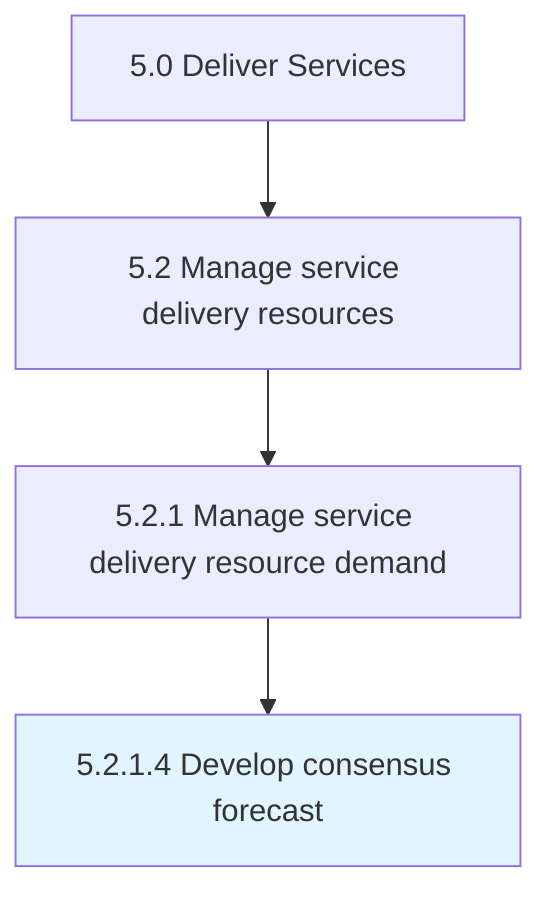

# Develop consensus forecast

> Arriving at a consensus over the forecasted levels of demand for services by analyzing baseline forecasts and customer input.

## Overview

Activity 5.2.1.4 is an activity within the Deliver Services framework. 

Arriving at a consensus over the forecasted levels of demand for services by analyzing baseline forecasts and customer input.

## Process Hierarchy



## Key Statistics

| Metric | Value |
|--------|-------|
| APQC Code | 20045 |
| Hierarchy ID | 5.2.1.4 |
| Level | Activity |
| Parent | [5.2.1](../) |
| Sub-Processes | 0 |


## GraphDL Semantic Structure

```
develop.ConsensusForecast
```

| Component | Value | Description |
|-----------|-------|-------------|
| Verb | `develop` | Primary action |
| Object | `consensus forecast` | Direct object |


## Related Concepts

- [ConsensusForecast](/concepts/ConsensusForecast)


---

*Source: APQC PCF 20045 (5.2.1.4) - APQC*
