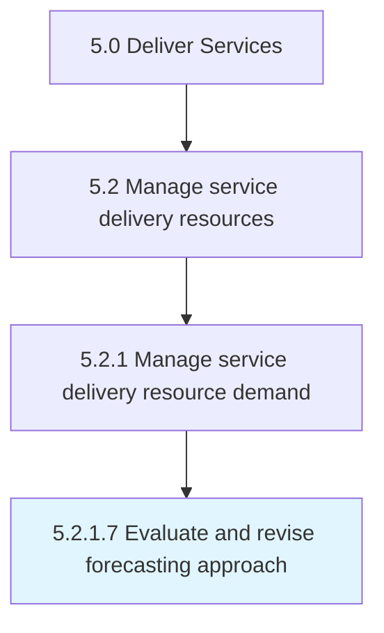
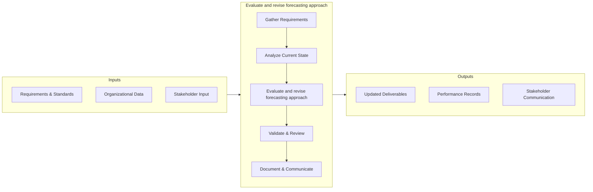
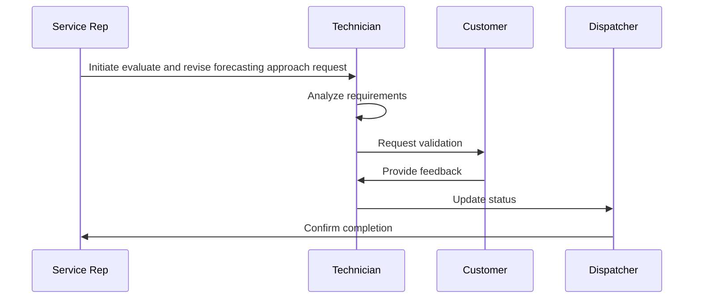

# Evaluate and revise forecasting approach

> Recognizing potential problems in the current forecast and making the necessary changes to align the forecast meet demand.

## Overview

This activity encompasses the end-to-end process of evaluate and revise forecasting approach within the service delivery and governance domain. It involves coordinating cross-functional teams, applying standardized methodologies, and leveraging organizational data to ensure consistent and effective outcomes. The process is aligned with the broader Deliver Services framework (APQC 5.2.1.7) and supports strategic objectives by translating operational requirements into actionable procedures.

Effective execution of this activity requires clear ownership, well-defined inputs and outputs, and continuous monitoring against established benchmarks. Organizations that excel at this process typically integrate it with upstream planning activities and downstream performance measurement, creating a feedback loop that drives ongoing improvement and adaptation to changing business conditions.


## Process Hierarchy



## Key Statistics

| Metric | Value |
|--------|-------|
| APQC Code | 20048 |
| Hierarchy ID | 5.2.1.7 |
| Level | Activity |
| Parent | [5.2.1](../) |
| Sub-Processes | 0 |


## GraphDL Semantic Structure

```graphdl
evaluate.AndReviseForecastingApproach
```

| Component | Value | Description |
|-----------|-------|-------------|
| Verb | `evaluate` | Primary action |
| Object | `and revise forecasting approach` | Direct object |


## Process Flow




## Process Sequence


## RACI Matrix

| Activity | Service Delivery Manager | Operations Director | Quality Assurance Team | Business Development |
|----------|:-:|:-:|:-:|:-:|
| Gather Requirements | R | A | C | I |
| Analyze Current State | R | I | C | I |
| Evaluate and revise forecasting approach | R | A | C | I |
| Validate & Review | C | A | R | I |
| Document & Communicate | R | I | I | C |

## Related Occupations

- [Service Delivery Manager](/occupations/ServiceDeliveryManagers)
- [Operations Manager](/occupations/Management/OperationsManagers)
- [Business Analyst](/occupations/BusinessAnalysts)
- [Quality Assurance Specialist](/occupations/QualityAssuranceSpecialists)

## Related Departments

- Service Operations
- Business Development
- Quality Management

## Industry Variations

### Professional Services
Focus on billable utilization, client engagement models, and knowledge management across consulting and advisory practices.

### Healthcare
Emphasis on patient outcomes, regulatory compliance (HIPAA), and care coordination across multidisciplinary teams.

### Financial Services
Prioritization of risk management, regulatory adherence, and digital transformation of client-facing services.

## KPIs & Metrics

| KPI | Description | Unit |
|-----|-------------|------|
| Cycle Time | Average time to complete evaluate and revise forecasting approach process | Hours/Days |
| Completion Rate | Percentage of and revise forecasting approach activities completed on schedule | % |
| Quality Score | Accuracy and quality rating of and revise forecasting approach outputs | 1-10 Scale |
| Cost Efficiency | Cost per unit of and revise forecasting approach processed | $/Unit |
| Service Level Agreement (SLA) Compliance | Percentage of activities meeting SLA targets | % |

## Related Concepts

- ForecastingApproach
- ForecastingApproach


---

*Source: APQC PCF 20048 (5.2.1.7) - APQC*
