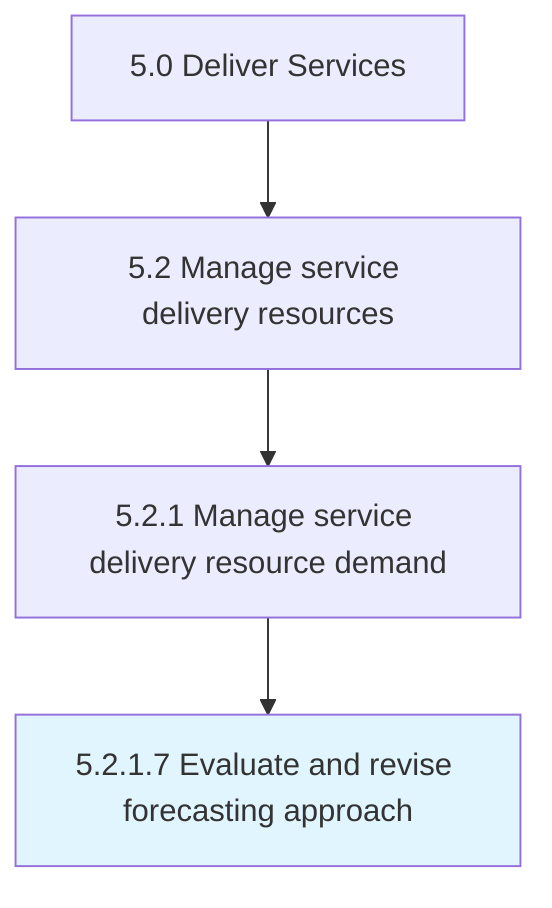

# Evaluate and revise forecasting approach

> Recognizing potential problems in the current forecast and making the necessary changes to align the forecast meet demand.

## Overview

Activity 5.2.1.7 is an activity within the Deliver Services framework. 

Recognizing potential problems in the current forecast and making the necessary changes to align the forecast meet demand.

## Process Hierarchy



## Key Statistics

| Metric | Value |
|--------|-------|
| APQC Code | 20048 |
| Hierarchy ID | 5.2.1.7 |
| Level | Activity |
| Parent | [5.2.1](../) |
| Sub-Processes | 0 |


## GraphDL Semantic Structure

```
evaluate.AndReviseForecastingApproach
```

| Component | Value | Description |
|-----------|-------|-------------|
| Verb | `evaluate` | Primary action |
| Object | `and revise forecasting approach` | Direct object |


## Related Concepts

- ForecastingApproach
- ForecastingApproach


---

*Source: APQC PCF 20048 (5.2.1.7) - APQC*
