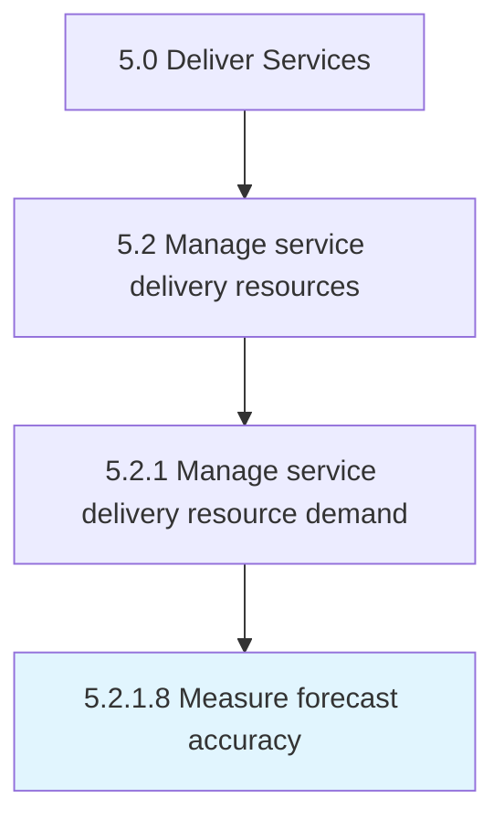

# Measure forecast accuracy

> Analyzing forecasting against actuals to determine accuracy.

## Overview

Activity 5.2.1.8 is an activity within the Deliver Services framework. 

Analyzing forecasting against actuals to determine accuracy. Modify forecasting to align with actual need.

## Process Hierarchy



## Key Statistics

| Metric | Value |
|--------|-------|
| APQC Code | 20049 |
| Hierarchy ID | 5.2.1.8 |
| Level | Activity |
| Parent | [5.2.1](../) |
| Sub-Processes | 0 |


## GraphDL Semantic Structure

```
measure.ForecastAccuracy
```

| Component | Value | Description |
|-----------|-------|-------------|
| Verb | `measure` | Primary action |
| Object | `forecast accuracy` | Direct object |


## Related Concepts

- [ForecastAccuracy](/concepts/ForecastAccuracy)


---

*Source: APQC PCF 20049 (5.2.1.8) - APQC*
