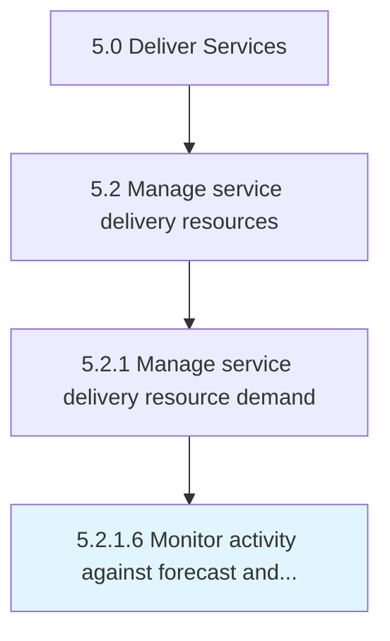

# Monitor activity against forecast and revise forecast

> Overseeing all activities necessary to deliver services to customer.

## Overview

Activity 5.2.1.6 is an activity within the Deliver Services framework. 

Overseeing all activities necessary to deliver services to customer. Revise forecast to account for any issues that may arise. This could be changes in market trend, resource changes, etc.

## Process Hierarchy



## Key Statistics

| Metric | Value |
|--------|-------|
| APQC Code | 20047 |
| Hierarchy ID | 5.2.1.6 |
| Level | Activity |
| Parent | [5.2.1](../) |
| Sub-Processes | 0 |


## GraphDL Semantic Structure

```
monitor.Activity.against.ForecastAndReviseForecast
```

| Component | Value | Description |
|-----------|-------|-------------|
| Verb | `monitor` | Primary action |
| Object | `activity` | Direct object |
| Preposition | `against` | Relationship |
| PrepObject | `forecast and revise forecast` | Indirect object |


## Related Concepts

- [Activity](/concepts/Activity)
- [Forecast](/concepts/Forecast)
- [ReviseForecast](/concepts/ReviseForecast)


---

*Source: APQC PCF 20047 (5.2.1.6) - APQC*
