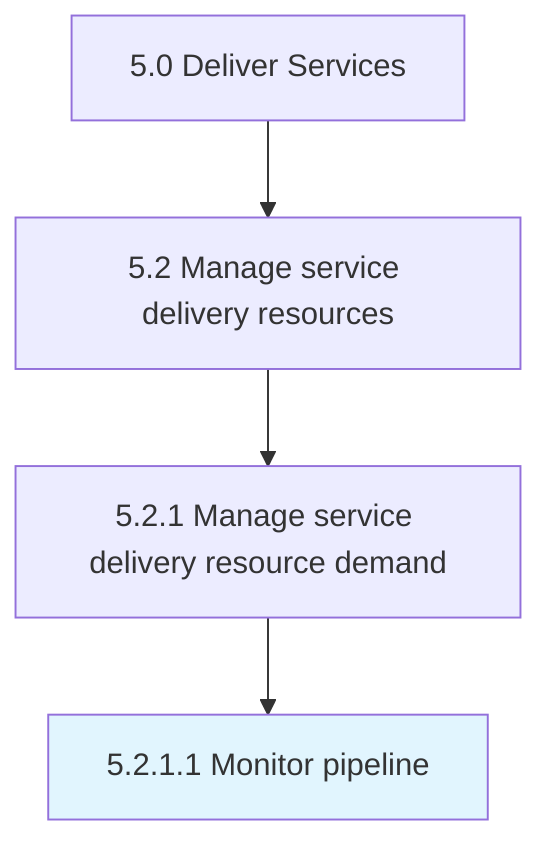

# Monitor pipeline

> Tracking potential opportunities as they move through the various stages of the pipeline.

## Overview

Activity 5.2.1.1 is an activity within the Deliver Services framework. 

Tracking potential opportunities as they move through the various stages of the pipeline.

## Process Hierarchy



## Key Statistics

| Metric | Value |
|--------|-------|
| APQC Code | 20042 |
| Hierarchy ID | 5.2.1.1 |
| Level | Activity |
| Parent | [5.2.1](../) |
| Sub-Processes | 0 |


## GraphDL Semantic Structure

```
monitor.Pipeline
```

| Component | Value | Description |
|-----------|-------|-------------|
| Verb | `monitor` | Primary action |
| Object | `pipeline` | Direct object |


## Related Concepts

- [Pipeline](/concepts/Pipeline)


---

*Source: APQC PCF 20042 (5.2.1.1) - APQC*
