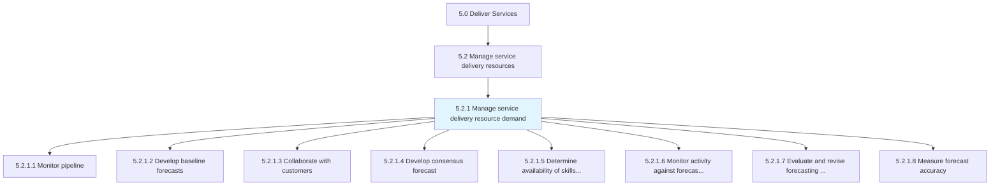
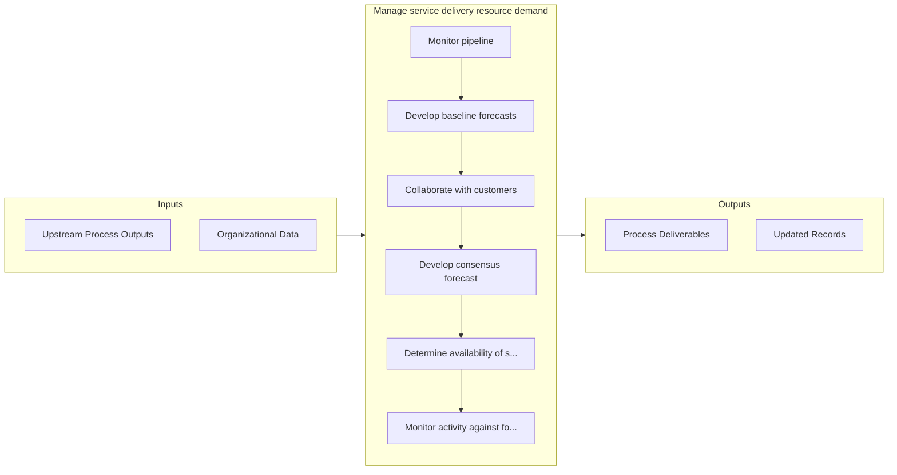

# Manage service delivery resource demand

> Ensuring necessary resources are maintained through monitoring pipeline, developing forecasts, and collaborating with customers.

## Overview

Process 5.2.1 is a core process that defines the specific procedures for manage service delivery resource demand. 

Ensuring necessary resources are maintained through monitoring pipeline, developing forecasts, and collaborating with customers. Determine skills needed for service deliver and forecast customer orders. Monitor forecasted orders and modify if where needed. Measure forecast accuracy.

## Process Hierarchy



## Key Statistics

| Metric | Value |
|--------|-------|
| APQC Code | 20041 |
| Hierarchy ID | 5.2.1 |
| Level | Process |
| Parent | [5.2](../) |
| Sub-Processes | 8 |


## GraphDL Semantic Structure

```
manage.ServiceDeliveryResourceDemand
```

| Component | Value | Description |
|-----------|-------|-------------|
| Verb | `manage` | Primary action |
| Object | `service delivery resource demand` | Direct object |


## Process Flow



## Sub-Processes

| Process | Hierarchy ID | Description |
|---------|-------------|-------------|
| [Monitor pipeline](./MonitorPipeline) | 5.2.1.1 | Tracking potential opportunities as they move through the various stages of the pipeline |
| [Develop baseline forecasts](./DevelopBaselineForecasts) | 5.2.1.2 | Identifying the demand anticipated for the organization's services |
| [Collaborate with customers](./CollaborateWithCustomers) | 5.2.1.3 | Providing a collaborative meeting in which to engage the customer to understand the scope of their n |
| [Develop consensus forecast](./DevelopConsensusForecast) | 5.2.1.4 | Arriving at a consensus over the forecasted levels of demand for services by analyzing baseline fore |
| [Determine availability of skills to deliver on current and forecast customer orders](./DetermineAvailabilityOfSkillsToDeliverOnCurrentAndForecastCustomerOrders) | 5.2.1.5 | Identifying what skillset is necessary for the delivery of opportunities |
| [Monitor activity against forecast and revise forecast](./MonitorActivityAgainstForecastAndReviseForecast) | 5.2.1.6 | Overseeing all activities necessary to deliver services to customer |
| [Evaluate and revise forecasting approach](./EvaluateAndReviseForecastingApproach) | 5.2.1.7 | Recognizing potential problems in the current forecast and making the necessary changes to align the |
| [Measure forecast accuracy](./MeasureForecastAccuracy) | 5.2.1.8 | Analyzing forecasting against actuals to determine accuracy |


## Related Concepts

- ServiceDeliveryResourceDemand


---

*Source: APQC PCF 20041 (5.2.1) - APQC*
