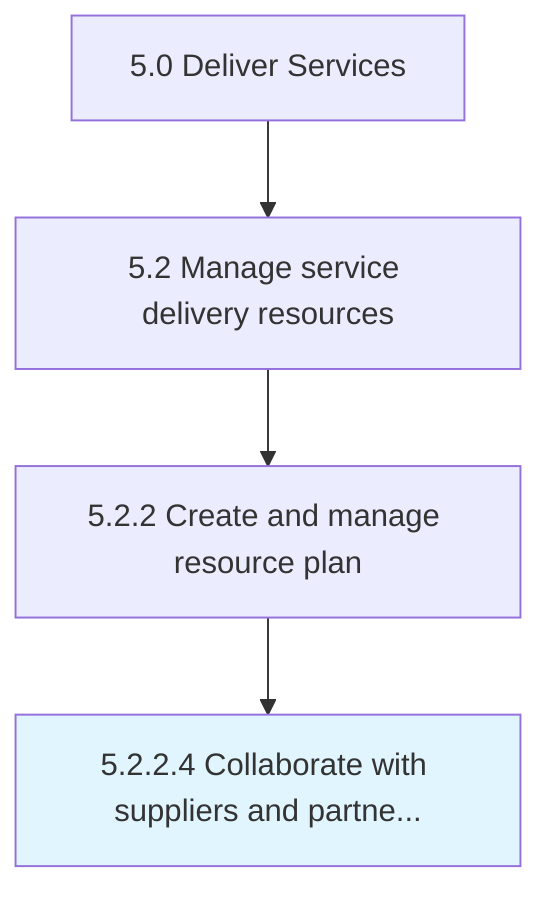

# Collaborate with suppliers and partners to supplement skills and capabilities

> Understanding organizational need to enlist suppliers to provide resources for gaps in skills and capabilities.

## Overview

Activity 5.2.2.4 is an activity within the Deliver Services framework. 

Understanding organizational need to enlist suppliers to provide resources for gaps in skills and capabilities. Identify where additional skills are needed and collaborate with third parties to fill those demands.

## Process Hierarchy



## Key Statistics

| Metric | Value |
|--------|-------|
| APQC Code | 20054 |
| Hierarchy ID | 5.2.2.4 |
| Level | Activity |
| Parent | [5.2.2](../) |
| Sub-Processes | 0 |


## GraphDL Semantic Structure

```
collaborate.WithSuppliersAndPartnersToSupplementSkillsAndCapabilities
```

| Component | Value | Description |
|-----------|-------|-------------|
| Verb | `collaborate` | Primary action |
| Object | `with suppliers and partners to supplement skills and capabilities` | Direct object |


## Related Concepts

- SuppliersToSupplementSkills
- SuppliersToCapabilities
- Partners
- SupplementSkills
- Partners
- Capabilities


---

*Source: APQC PCF 20054 (5.2.2.4) - APQC*
