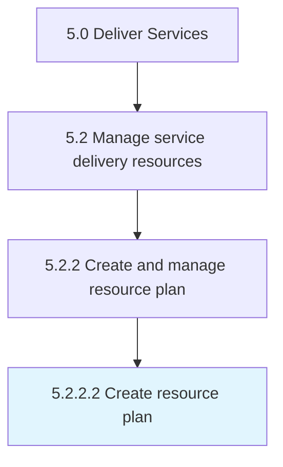

# Create resource plan

> Creating a plan to ensure that all resources are available to carry out services required for the customer.

## Overview

Activity 5.2.2.2 is an activity within the Deliver Services framework. 

Creating a plan to ensure that all resources are available to carry out services required for the customer. This can include physical resources and personnel.

## Process Hierarchy



## Key Statistics

| Metric | Value |
|--------|-------|
| APQC Code | 20052 |
| Hierarchy ID | 5.2.2.2 |
| Level | Activity |
| Parent | [5.2.2](../) |
| Sub-Processes | 0 |


## GraphDL Semantic Structure

```
create.ResourcePlan
```

| Component | Value | Description |
|-----------|-------|-------------|
| Verb | `create` | Primary action |
| Object | `resource plan` | Direct object |


## Related Concepts

- ResourcePlan


---

*Source: APQC PCF 20052 (5.2.2.2) - APQC*
